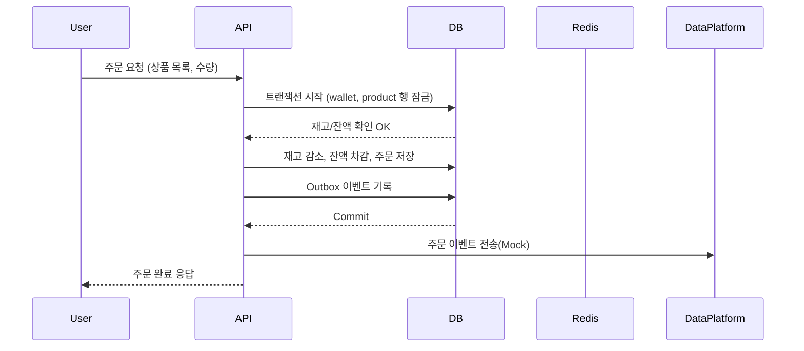
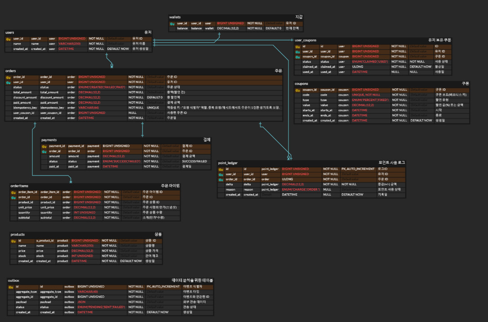
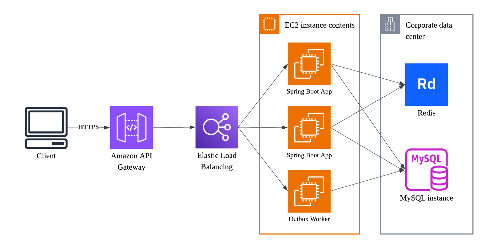

## 프로젝트

## Getting Started

### Prerequisites

#### Running Docker Containers

`local` profile 로 실행하기 위하여 인프라가 설정되어 있는 Docker 컨테이너를 실행해주셔야 합니다.

```bash
docker-compose up -d
```

# e-커머스 상품 주문 서비스 시나리오

## 요구사항 및 유스케이스 정의

- 상품 주문에 필요한 메뉴 정보들을 구성하고 조회가 가능해야 합니다.
- 사용자는 상품을 여러개 선택해 주문할 수 있고, 미리 충전한 잔액을 이용합니다.
- 상품 주문 내역을 통해 판매량이 가장 높은 상품을 추천합니다.

## 목표

- 사용자는 여러 상품을 선택해 주문할 수 있습니다.
- 주문 결제는 **충전된 포인트 잔액**으로만 가능합니다.
- 상품 재고와 사용자 잔액은 **동시성 상황에서도 정합성**을 유지해야 합니다.
- 주문 성공 시, **데이터 플랫폼(외부 서비스)** 으로 주문 정보를 실시간 전송해야 합니다.
- 선착순 쿠폰 및 인기 상품 추천 기능을 통해 부가 기능을 제공합니다.

## 🧩 기능 목록 (Requirements)

### ✅ 필수 기능

| 구분 | 기능                      | 설명                                    |
|----|-------------------------|---------------------------------------|
| 1  | **상품 조회 API**           | 상품 목록(ID, 이름, 가격, 잔여수량) 조회            |
| 2  | **주문 / 결제 API**         | 사용자 ID와 (상품ID, 수량) 목록 입력 → 주문 및 결제 처리 |
| 3  | **포인트 충전 / 조회 API**     | 사용자의 포인트 충전 및 잔액 조회                   |
| 4  | **외부 데이터 플랫폼 연동(Mock)** | 주문 완료 시, 외부 API로 주문 데이터 전송            |
| 5  | **재고 / 잔액 동시성 제어**      | 다중 트랜잭션 환경에서도 정합성 유지 (락/트랜잭션)         |

### ⚙️ 선택 기능

| 구분 | 기능               | 설명                          |
|----|------------------|-----------------------------|
| 6  | **선착순 쿠폰 기능**    | 쿠폰 발급 및 사용 / 유효성 검증 / 할인 적용 |
| 7  | **인기 상품 조회 API** | 최근 3일간 판매량 기준 상위 5개 상품 조회   |

---

## 🧠 비기능 요구사항 (Non-functional Requirements)

| 항목      | 내용                                             |
|---------|------------------------------------------------|
| 성능      | 1초 내 API 응답, 동시 주문 100건 이상 처리 가능               |
| 데이터 일관성 | 주문/결제/재고/포인트는 트랜잭션 단위로 원자적 처리                  |
| 확장성     | 다중 인스턴스 환경에서도 쿠폰/재고 정합성 유지                     |
| 테스트     | 모든 기능별 단위 테스트 및 통합 테스트 (Testcontainers 기반)     |
| 가용성     | Docker Compose로 로컬 통합 실행 가능 (MySQL + Redis 포함) |
| 보안      | 인증/인가 Mock 처리 (유저ID 기반)                        |

---

## 📋 유스케이스 (Use Cases)

### 1️⃣ 상품 조회

**Actor**: 사용자  
**Flow**:

1. 사용자가 상품 목록 페이지 접속
2. 서버는 상품 정보(ID, 이름, 가격, 잔여수량)를 반환
3. 사용자에게 실시간 재고 상태를 표시

**예외**: 상품 데이터 불일치 시 최신 재고 기준으로 반환

---

### 2️⃣ 주문 및 결제

**Actor**: 사용자  
**Flow**:

1. 사용자가 장바구니에서 상품 목록과 수량 선택
2. 서버는 해당 상품 재고와 사용자 잔액을 트랜잭션 내에서 확인
3. 재고 및 잔액이 충분하면 결제 → 잔액 차감, 재고 감소
4. 주문/결제 성공 시, **주문 이벤트를 Outbox 테이블에 기록**
5. Outbox 워커가 외부 데이터 플랫폼(Mock API)으로 전송

**예외 플로우**:

- [E-01] 재고 부족 → 주문 실패
- [E-02] 잔액 부족 → 결제 실패
- [E-03] 외부 전송 실패 → Outbox 상태 `FAILED` 로 남기고 재시도

---

### 3️⃣ 포인트 충전 / 조회

**Actor**: 사용자  
**Flow**:

1. 사용자가 충전 금액 입력
2. 서버는 해당 유저의 `wallet` 행을 잠그고 금액을 증가
3. 성공 시 최신 잔액 반환

**예외**:

- DB 트랜잭션 실패 시 충전 반영 안 됨
- 잘못된 유저ID 입력 시 404 반환

---

### 4️⃣ 선착순 쿠폰 발급 / 사용

**Actor**: 사용자  
**Flow**:

1. 사용자가 특정 쿠폰 코드로 쿠폰 발급 요청
2. Redis `DECR`로 잔여 수량 원자 감소
3. 성공 시 DB에 `user_coupons` INSERT
4. 주문 시 쿠폰코드를 함께 제출하면 할인 적용
5. 사용된 쿠폰은 상태 `USED`로 변경

**예외**:

- [C-01] 쿠폰 수량 소진 → 발급 실패
- [C-02] 이미 발급받은 사용자 → 중복 발급 방지

---

### 5️⃣ 인기 상품 조회

**Actor**: 사용자 / 관리자  
**Flow**:

1. 최근 3일간 `order_items` 기준으로 판매량 합산
2. 판매량 상위 5개 상품 반환
3. Redis에 캐싱 (1분 TTL)

---

## ⚡ 시스템 동작 시나리오 요약



# 🗄️ ERD 설계

## 📌 개요

본 프로젝트는 e-커머스 주문 서비스의 **정합성, 동시성, 멱등성**을 모두 고려한 데이터베이스 설계를 기반으로 합니다.  
다중 인스턴스 환경에서도 재고/포인트/쿠폰의 무결성을 유지하며, Outbox 패턴을 통해 외부 데이터 플랫폼과의 **데이터 일관성**을 보장합니다.

> 🔗 ERD Cloud Diagram: [ERD Cloud 바로가기](https://www.erdcloud.com/p/BNbziboLiCBswccSH)



---

### 🧱 테이블 구조 요약

| 테이블명             | 주요 컬럼 요약                                                                                                                             | 핵심 제약 / 인덱스                                                                                                                        | 설명                             |
|------------------|--------------------------------------------------------------------------------------------------------------------------------------|------------------------------------------------------------------------------------------------------------------------------------|--------------------------------|
| **users**        | `user_id`, `name`, `created_at`                                                                                                      | PK(`user_id`)                                                                                                                      | 사용자 기본 정보                      |
| **wallets**      | `user_id`, `balance`                                                                                                                 | PK(`user_id`), FK→`users`, `CHECK(balance ≥ 0)`                                                                                    | 사용자 포인트 잔액 관리                  |
| **orders**       | `order_id`, `user_id`, `status`, `total_amount`, `discount_amount`, `paid_amount`, `idempotency_key`, `user_coupon_id`, `created_at` | `UNIQUE(idempotency_key)`<br>`FK(user_coupon_id → user_coupons.id)`<br>`INDEX(status, created_at)`<br>`INDEX(user_id, created_at)` | 주문 / 결제 단위 데이터. 멱등키로 중복 요청 방지  |
| **order_items**  | `order_item_id`, `order_id`, `product_id`, `unit_price`, `quantity`, `subtotal`                                                      | `UNIQUE(order_id, product_id)`<br>`CHECK(quantity > 0)`<br>`CHECK(unit_price ≥ 0)`<br>`CHECK(subtotal ≥ 0)`                        | 주문 상세 품목. 같은 상품 중복 삽입 방지       |
| **payments**     | `payment_id`, `order_id`, `amount`, `status`, `paid_at`                                                                              | `UNIQUE(order_id)`<br>`ENUM('SUCCESS','FAILED')`                                                                                   | 주문 1건당 결제 1회 보장                |
| **products**     | `id`, `name`, `price`, `stock`, `created_at`                                                                                         | PK(`id`), `CHECK(stock ≥ 0)`                                                                                                       | 상품 기본 정보 / 재고 관리               |
| **coupons**      | `coupon_id`, `code`, `type`, `value`, `starts_at`, `ends_at`, `created_at`                                                           | `UNIQUE(code)`<br>`ENUM('PERCENT','FIXED')`                                                                                        | 쿠폰 정의 테이블 (선착순 발급 기준)          |
| **user_coupons** | `id`, `user_id`, `coupon_id`, `status`, `claimed_at`, `used_at`                                                                      | `UNIQUE(user_id, coupon_id)`<br>`INDEX(user_id, status)`                                                                           | 사용자별 쿠폰 보유/사용 내역               |
| **point_ledger** | `id`, `user_id`, `order_id`, `delta`, `reason`, `created_at`                                                                         | PK(`id`), `ENUM('CHARGE','ORDER')`                                                                                                 | 포인트 증감 로그. 결제 시 차감, 충전 시 증가 기록 |
| **outbox**       | `id`, `aggregate_type`, `aggregate_id`, `payload`, `status`, `created_at`                                                            | `INDEX(status, id)`<br>`ENUM('PENDING','SENT','FAILED')`                                                                           | 외부 데이터 플랫폼 전송 보장용 이벤트 로그       |

---

### 💡 설계 포인트

| 구분                    | 설명                                                     |
|-----------------------|--------------------------------------------------------|
| **정합성 보장**            | `FOR UPDATE` 트랜잭션으로 Wallet / Product 재고를 안전하게 잠금       |
| **멱등성 (Idempotency)** | `orders.idempotency_key UNIQUE` 로 중복 주문 생성 방지          |
| **데이터 추적성**           | Coupon → UserCoupon → Order 흐름으로 쿠폰 사용 내역 추적 가능        |
| **무결성 제약**            | CHECK, UNIQUE, FK로 음수/중복/고아 데이터 방지                     |
| **Outbox 패턴**         | 주문 커밋과 외부 전송(데이터 플랫폼 연동)을 원자적으로 분리                     |
| **조회 성능**             | `status`, `user_id`, `created_at` 기반 인덱스로 통계/이력 조회 최적화 |

---

### 🧩 ERD 특징 요약

- **트랜잭션 중심 처리:** Wallet + Product + Order를 한 트랜잭션으로 묶어 동시성 문제 방지
- **재고 및 포인트 정합성:** DB 단에서만 관리하며 비즈니스 레벨 Lock 불필요
- **Outbox 기반 확장성:** 데이터 분석 플랫폼 등 외부 시스템 연계에 안전
- **정규화 완료:** 데이터 중복 최소화, 인덱스 효율 극대화
- **확장 가능:** 주문, 쿠폰, 포인트 기능을 독립적으로 확장 가능

---

아래는 **Swagger 없이, 실제 API만** 정리한 **README.md용 명세서**예요. 그대로 `README.md`(또는 `Readmd.md`)에 붙여 넣으면 됩니다.

---

# 📑 API 명세서 (v1) — E-commerce 주문 서비스

- Base URL: `/api/v1`
- Auth(모킹): `X-User-Id: <long>` (요청 사용자 식별용)
- Content-Type: `application/json; charset=utf-8`
- 시간 형식: ISO-8601 UTC (`yyyy-MM-dd'T'HH:mm:ss'Z'`)
- 멱등성: 쓰기 API는 `Idempotency-Key: <string>` 헤더 지원(중복 요청 방지)

---

## 에러 응답 규격

### 공통 에러 포맷

```json
{
  "timestamp": "2025-11-09T12:34:56Z",
  "path": "/api/v1/orders",
  "error": "OUT_OF_STOCK",
  "message": "재고가 부족합니다.",
  "traceId": "f3f1f3..."
}
```

### 공통 에러 코드

| code                   | 설명                     | HTTP |
| ---------------------- | ---------------------- | ---- |
| VALIDATION_ERROR       | 파라미터/바디 검증 실패          | 400  |
| UNAUTHORIZED           | `X-User-Id` 누락/유효하지 않음 | 401  |
| FORBIDDEN              | 권한 없음                  | 403  |
| NOT_FOUND              | 리소스 없음                 | 404  |
| CONFLICT               | 멱등 충돌/중복 요청 등          | 409  |
| OUT_OF_STOCK           | 재고 부족                  | 409  |
| INSUFFICIENT_BALANCE   | 잔액 부족                  | 409  |
| COUPON_INVALID         | 쿠폰 코드/기간/소유 불일치        | 400  |
| COUPON_SOLD_OUT        | 선착순 소진                 | 409  |
| COUPON_ALREADY_CLAIMED | 이미 발급받음                | 409  |
| INTERNAL_ERROR         | 서버 오류                  | 500  |

---

## 1) 상품 조회

### GET `/products`

상품 목록 페이지 조회.

**Query**

| name | type   | required | default          | 설명       |        |
| ---- | ------ | -------- | ---------------- | -------- | ------ |
| page | int    | N        | 0                | 0-base   |        |
| size | int    | N        | 20               | 1~100    |        |
| sort | string | N        | `createdAt, desc` | `필드, (asc | desc)` |

**Response 200**

```json
{
"content": [
{"id": 101, "name": "블루티셔츠", "price": 19900.00, "stock": 42, "createdAt": "2025-11-09T12:31:00Z" }
],
"page": 0,
"size": 20,
"totalElements": 123,
"totalPages": 7
}
```

---

## 2) 주문/결제

### POST `/orders`

장바구니 아이템 결제 후 주문 생성(트랜잭션 내에서 잔액/재고 차감).

**Headers**

* `X-User-Id: <long>` (필수)
* `Idempotency-Key: <string>` (권장, 같은 요청 재시도 시 중복 생성 방지)

**Request**

```json
{
  "items": [
    {
      "productId": 101,
      "qty": 2
    },
    {
      "productId": 202,
      "qty": 1
    }
  ],
  "couponCode": "WELCOME10"
}
```

* 제약: `items` 1~100개, `qty` ≥ 1

**Response 201**

```json
{
  "orderId": 5551,
  "status": "PAID",
  "totalAmount": 59700.00,
  "discountAmount": 5970.00,
  "paidAmount": 53730.00,
  "appliedCoupon": {
    "code": "WELCOME10"
  },
  "items": [
    {
      "productId": 101,
      "name": "블루티셔츠",
      "unitPrice": 19900.00,
      "qty": 2,
      "subtotal": 39800.00
    },
    {
      "productId": 202,
      "name": "화이트모자",
      "unitPrice": 19900.00,
      "qty": 1,
      "subtotal": 19900.00
    }
  ],
  "userPointBalance": 120270.00,
  "createdAt": "2025-11-09T12:35:20Z"
}
```

**주요 에러**

* `409 OUT_OF_STOCK`
* `409 INSUFFICIENT_BALANCE`
* `400 COUPON_INVALID`
* `409 CONFLICT` (동일 `Idempotency-Key`에 요청 바디 상이)

---

## 3) 포인트 충전 / 조회

### POST `/wallets/charge`

지갑 포인트 충전(멱등키 지원).

**Headers**

* `X-User-Id` (필수)
* `Idempotency-Key` (권장)

**Request**

```json
{
  "amount": 50000.00
}
```

* 제약: `amount` > 0

**Response 200**

```json
{
  "userId": 1,
  "balance": 153000.00
}
```

---

### GET `/wallets`

요청 사용자 지갑 잔액 조회.

**Headers**

* `X-User-Id` (필수)

**Response 200**

```json
{
  "userId": 1,
  "balance": 153000.00
}
```

---

## 4) 선착순 쿠폰

### POST `/coupons/{code}/claim`

쿠폰 선착순 발급. Redis `DECR` + DB `UNIQUE(user_id,coupon_id)`로 1인 1매 보장.

**Headers**

* `X-User-Id` (필수)

**Path**

* `code`: string

**Response 200**

```json
{
  "couponId": 10,
  "code": "WELCOME10",
  "type": "PERCENT",
  "value": 10.00,
  "claimedAt": "2025-11-09T12:40:00Z",
  "status": "CLAIMED"
}
```

**에러**

* `409 COUPON_SOLD_OUT`
* `409 COUPON_ALREADY_CLAIMED`
* `400 COUPON_INVALID`

---

### GET `/users/{userId}/coupons`

사용자의 보유 쿠폰 목록 조회.

**Response 200**

```json
{
  "userId": 1,
  "coupons": [
    {
      "couponId": 10,
      "code": "WELCOME10",
      "status": "CLAIMED",
      "claimedAt": "2025-11-09T12:40:00Z"
    },
    {
      "couponId": 11,
      "code": "XMAS5000",
      "status": "USED",
      "claimedAt": "2025-12-01T10:00:00Z",
      "usedAt": "2025-12-02T09:00:00Z"
    }
  ]
}
```

---

## 5) 인기 상품 조회

### GET `/stats/popular-products`

최근 N일간 판매량 기준 상위 K개 상품.

**Query**

| name  | type | default | 범위   | 설명       |
|-------|------|---------|------|----------|
| days  | int  | 3       | 1~30 | 집계 기간(일) |
| limit | int  | 5       | 1~50 | 상위 개수    |

**Response 200**

```json
{
  "rangeDays": 3,
  "limit": 5,
  "products": [
    {
      "productId": 101,
      "name": "블루티셔츠",
      "price": 19900.00,
      "soldQty": 124
    },
    {
      "productId": 202,
      "name": "화이트모자",
      "price": 19900.00,
      "soldQty": 98
    }
  ],
  "generatedAt": "2025-11-09T12:45:00Z"
}
```

---

## 멱등성 규칙

* `Idempotency-Key`가 같은 **동일 요청**은 항상 **같은 결과**를 반환.
* 같은 키로 **바디가 다른** 요청이 오면 `409 CONFLICT`.
* 키 보관/중복 판별 유효기간은 서버 설정(권장 24h).

---

## 구현 메모(요약)

* 주문 트랜잭션: `wallets` 및 `products`를 `SELECT ... FOR UPDATE`로 잠그고, **상품 ID 오름차순**으로 잠금 → 재고/잔액 차감 →
  `orders/order_items/payments/outbox` 기록 → 커밋.
* 쿠폰 발급: Redis `DECR coupon:{code}:quota` + `SETNX user_coupon:{code}:{userId}` 후 DB 반영.
* 인기상품: `orders.status='PAID'` + `orders.createdAt >= now()-interval :days day` 기준 집계(1~5분 캐시 권장).

---

# 🏗️ 인프라 구성도

본 서비스는 **모놀리식 Spring Boot 기반**으로 구현되며,  
**AWS 인프라 상에서 API Gateway → Elastic Load Balancer(ALB) → EC2 인스턴스 → RDB/Redis**  
흐름으로 구성되어 있습니다.



---

## 🔹 구성 요소별 설명

| 구성 요소 | 역할 | 설명 |
|------------|------|------|
| **Client (Web/Mobile)** | 서비스 이용자 | HTTPS 프로토콜로 API Gateway에 요청 |
| **Amazon API Gateway** | 엔트리 포인트 | - 인증/인가, 라우팅, CORS, RateLimit, TLS 종료 수행<br>- 내부 요청을 ALB로 전달 |
| **Elastic Load Balancer (ALB)** | 애플리케이션 로드밸런서 | - L7 HTTP 기반 트래픽 분산<br>- `/api/v1/*` 요청을 Spring Boot App으로 라우팅<br>- 헬스체크(`/actuator/health`) 수행 |
| **EC2 Instances (App Tier)** | 애플리케이션 서버 | - Spring Boot App 다중 인스턴스 실행<br>- Stateless 구조로 세션 공유 필요 없음<br>- Outbox Worker는 별도 프로필로 실행되어 데이터 플랫폼 전송 담당 |
| **Redis** | 캐시/선착순 쿠폰 관리 | - `DECR`, `SETNX`로 선착순 쿠폰 발급 동시성 처리<br>- 인기상품 캐시 (1~5분 TTL) |
| **MySQL (RDS 또는 EC2)** | 메인 데이터베이스 | - InnoDB 기반 트랜잭션 관리<br>- `FOR UPDATE`로 재고/포인트 정합성 보장 |
| **Outbox Worker** | 외부 데이터 연동 | - 주문/결제 성공 이벤트를 Outbox 테이블에서 읽어 외부 데이터 플랫폼으로 전송(Mock)<br>- 장애 시 재시도/백오프 가능 |
| **Corporate Data Center (or VPC 내부망)** | 내부 자원 | - MySQL, Redis 모두 Private Subnet 내 배치<br>- 외부로 직접 노출되지 않음 |

---

## 🔹 트래픽 흐름

1. **Client** → `HTTPS` 요청 → **API Gateway**
2. **API Gateway** → 요청 검증 후 → **Elastic Load Balancer (ALB)** 전달
3. **ALB** → 다중 **Spring Boot App (EC2 인스턴스)** 로 트래픽 분산
4. 각 App 인스턴스는 **MySQL** 및 **Redis** 와 통신하며
  - 주문/결제/포인트 등 주요 트랜잭션은 MySQL 트랜잭션 기반으로 처리
  - 쿠폰 발급 및 캐시는 Redis 원자 연산으로 관리
5. 결제 성공 시 **Outbox Worker** 가 이벤트를 읽어  
   외부 데이터 플랫폼(또는 Mock API)으로 전송

---

## 🔹 주요 특징

| 구분 | 내용 |
|------|------|
| **아키텍처 형태** | 모놀리식 (Spring Boot + JPA) |
| **확장성** | ALB로 수평 확장 (EC2 Auto Scaling) |
| **정합성** | MySQL 트랜잭션 + `SELECT ... FOR UPDATE` |
| **동시성 제어** | Redis `DECR` + DB UNIQUE 제약 |
| **멱등성 보장** | `Idempotency-Key` 헤더 + DB Unique Key |
| **외부 연동 안정성** | Outbox 패턴 (DB 커밋 이후 전송 보장) |
| **배포/운영** | Docker 기반 빌드 → EC2 배포 / TestContainers로 통합 테스트 |
| **보안** | HTTPS 종단점, DB/Redis는 Private Subnet 내부 |

---

## 🔹 네트워크 계층 요약

| 계층 | 서비스 | 설명 |
|------|---------|------|
| **L7 (HTTP)** | Amazon API Gateway, ALB | 요청 라우팅, 인증, RateLimit |
| **L4 (TCP)** | EC2 ↔ MySQL / Redis | 내부망 연결, 포트 제어 |
| **L3 (VPC)** | 보안 그룹, 서브넷 | 외부 접근 차단, 내부만 허용 |

---

## 🧰 확장/운영 가이드

| 항목 | 권장 설정 |
|------|------------|
| **Auto Scaling** | CPU ≥ 70% 또는 요청 수 기준 EC2 자동 확장 |
| **Health Check** | `/actuator/health` (Spring Boot 기본) |
| **로그 수집** | CloudWatch / OpenSearch 연동 |
| **Metrics** | Prometheus / CloudWatch (응답시간, 에러율) |
| **CI/CD** | GitHub Actions → Docker Build → ECR → EC2 배포 |
| **DB 백업** | RDS 자동 백업 또는 cron 스냅샷 (PITR 지원) |

---
