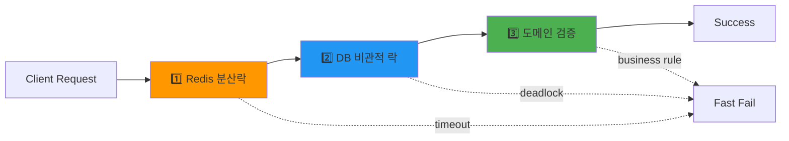
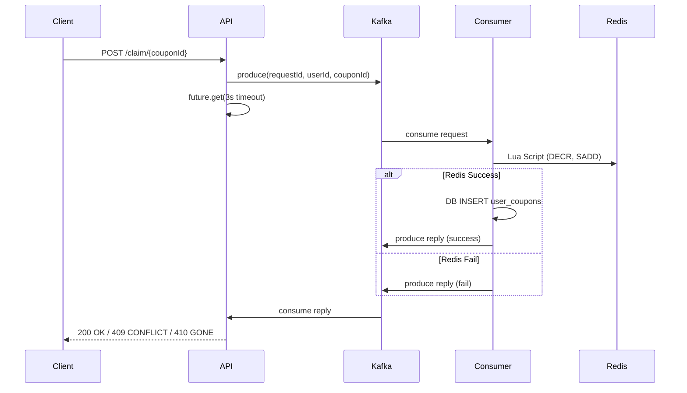
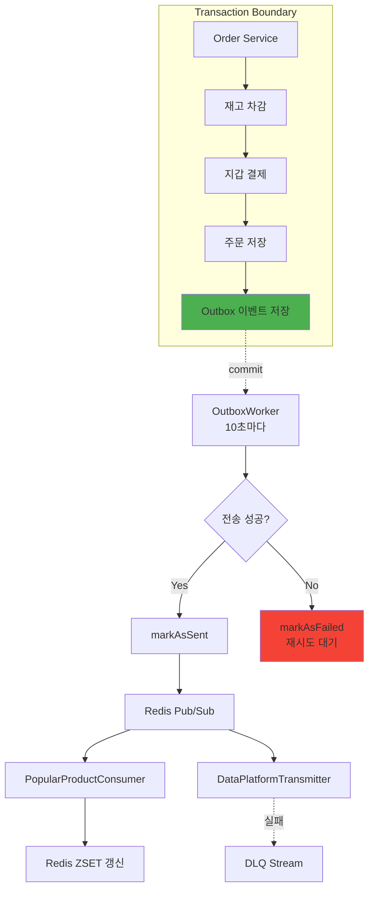
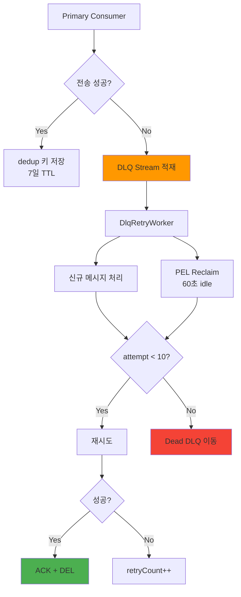
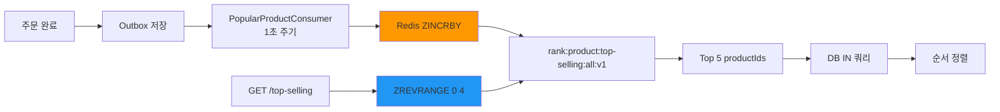
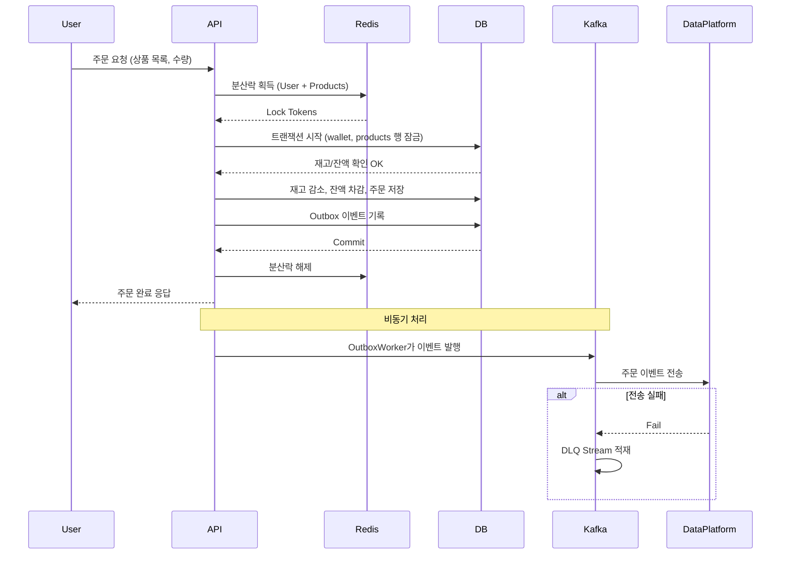
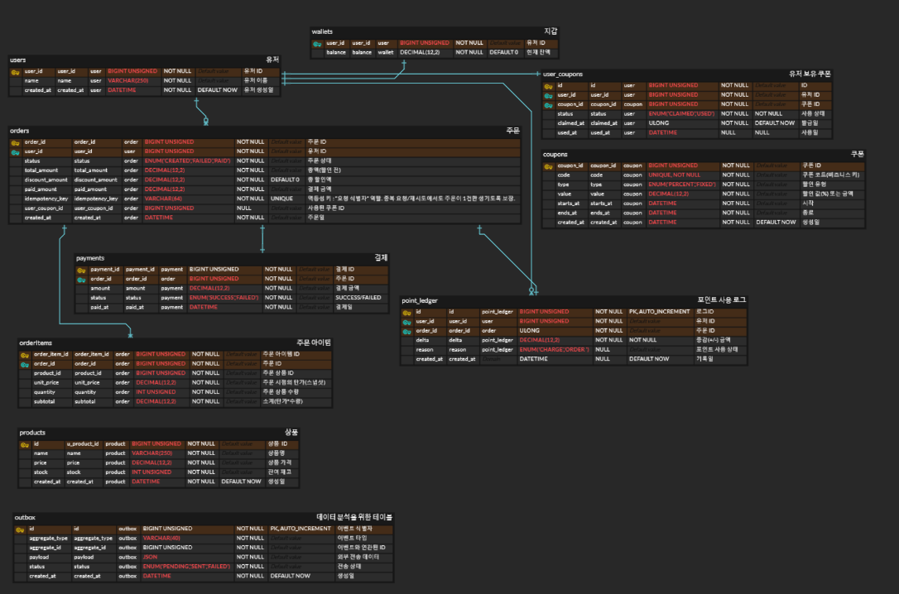
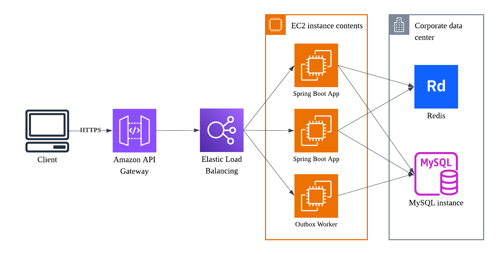
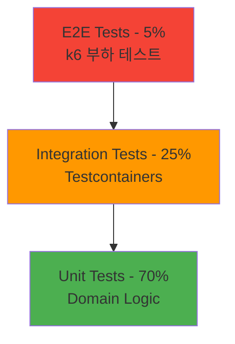

# 📦 E-Commerce 주문 시스템

> 항해99에서 항해 Lite 백엔드 과정을 진행하면서 **동시성 제어**, **분산 시스템 설계**, **장애 복구**를 구현한 포트폴리오 프로젝트

[](https://openjdk.org/)
[](https://spring.io/projects/spring-boot)
[](https://redis.io/)
[](https://kafka.apache.org/)
[](https://www.mysql.com/)

---

## 📋 목차

1. [프로젝트 개요](#-프로젝트-개요)
2. [기술적 하이라이트](#-기술적-하이라이트)
3. [성과 지표](#-성과-지표)
4. [요구사항 및 유스케이스](#-요구사항-및-유스케이스-정의)
5. [ERD 설계](#️-erd-설계)
6. [API 명세](#-api-명세서-v1--e-commerce-주문-서비스)
7. [인프라 구성](#️-인프라-구성도)
8. [테스트 전략](#-테스트-전략)
9. [실행 방법](#-실행-방법)
10. [트러블슈팅 & 학습 포인트](#-트러블슈팅--학습-포인트)

---

## 프로젝트 개요

### **목표**
**대규모 트래픽 환경에서 데이터 정합성을 보장**하는 E-Commerce 주문 시스템 구현

- 사용자는 여러 상품을 선택해 주문할 수 있습니다.
- 주문 결제는 **충전된 포인트 잔액**으로만 가능합니다.
- 상품 재고와 사용자 잔액은 **동시성 상황에서도 정합성**을 유지해야 합니다.
- 주문 성공 시, **데이터 플랫폼(외부 서비스)** 으로 주문 정보를 실시간 전송해야 합니다.
- 선착순 쿠폰 및 인기 상품 추천 기능을 통해 부가 기능을 제공합니다.

### **핵심 도메인**
- **주문/결제**: 멀티 상품 주문, 쿠폰 할인, 포인트 결제
- **재고 관리**: 동시성 제어, 낙관적/비관적 락
- **지갑 시스템**: 포인트 충전/차감, 잔액 검증
- **쿠폰 시스템**: 선착순 발급, Kafka 동기 응답
- **인기 상품 랭킹**: Redis ZSET 기반 실시간 집계

### 기술 문서 모음

> 프로젝트의 핵심 기술 결정, 설계 근거, 장애 대응 및 검증 과정을 정리한 문서 일람입니다.

| 분류           | 문서명                             | 설명                                         | 링크                                                                |
| ------------ | ------------------------------- | ------------------------------------------ | ----------------------------------------------------------------- |
| 트랜잭션 / MSA   | **MSA 분리 설계 & 트랜잭션 진단**         | Saga, Outbox 패턴, 멱등성·트랜잭션 경계 진단            | [Transaction_Diagnosis_문서.md](docs/Transaction_Diagnosis_문서.md)   |
| 동시성 제어       | **동시성 제어 전략 및 테스트**             | 재고/포인트/쿠폰 동시성 제어 전략과 IT 결과                 | [동시성_제어_전략_및_테스트.md](docs/동시성_제어_전략_및_테스트.md)                     |
| 분산락 / 캐시     | **분산락과 캐싱 전략 적용**               | Redis 기반 분산락, 캐시 적용 범위와 트레이드오프             | [분산락과_캐싱_전략_적용.md](docs/분산락과_캐싱_전략_적용.md)                         |
| Redis 활용     | **Redis 기반 랭킹 및 비동기 쿠폰 설계**     | 인기 상품 랭킹, 선착순 쿠폰 Redis 설계                  | [Redis_기반_랭킹_및_비동기_쿠폰_설계.md](docs/Redis_기반_랭킹_및_비동기_쿠폰_설계.md)     |
| 메시징 / Kafka  | **카프카 구조 및 동작 정리**              | Kafka 토픽, 컨슈머 그룹, 재시도 및 메시지 흐름             | [카프카_구조_및_동작_정리.md](docs/카프카_구조_및_동작_정리.md)                       |
| 비동기 설계       | **쿠폰 선착순 동시 발급 (Kafka 동기 대기)**  | Kafka 기반 요청–응답(동기 대기) 쿠폰 발급 설계             | [쿠폰_선착순_동시_발급_Kafka_동기_대기.md](docs/쿠폰_선착순_동시_발급_Kafka_동기_대기.md)   |
| 부하 테스트       | **부하 테스트 통합 문서**                | k6 기반 E2E 부하 테스트 시나리오 및 지표 해석              | [부하_테스트_통합_문서.md](docs/부하_테스트_통합_문서.md)                           |
| 장애 분석        | **쿠폰 발급 & 주문 E2E 부하 테스트 장애 대응** | RATE 50→300 장애 원인 분석 및 개선 Postmortem       | [쿠폰_발급_주문_E2E_부하_테스트_장애_대응.md](docs/쿠폰_발급_주문_E2E_부하_테스트_장애_대응.md) |


---

## 기술적 하이라이트

### 1️**3단계 동시성 제어 (Triple Defense Line)**


```mermaid
graph LR
    A[Client Request] --> B[1️⃣ Redis 분산락]
    B --> C[2️⃣ DB 비관적 락]
    C --> D[3️⃣ 도메인 검증]
    D --> E[Success]
    
    B -.timeout.-> F[Fast Fail]
    C -.deadlock.-> F
    D -.business rule.-> F
    
    style B fill:#ff9800
    style C fill:#2196f3
    style D fill:#4caf50
```

**적용 영역:** 주문 생성, 재고 차감, 지갑 결제, 쿠폰 사용

#### 설계 근거
1. **Redis 분산락**: 멀티 인스턴스 환경에서 진입 제어 (3초 wait)
2. **DB 비관적 락**: `SELECT FOR UPDATE`로 Row-level 동시성 보장
3. **도메인 검증**: 엔티티 내부 비즈니스 규칙 (예: `balance >= amount`)

#### 코드 구조
```java
// Facade Layer - 분산락
String token = redisLockService.tryLock("lock:wallet:user:" + userId, 3000, 5000);

try {
        // Service Layer - 트랜잭션 + 비관적 락
        walletService.debitTx(userId, amount);
} finally {
        redisLockService.unlock(key, token);
}

// Repository - 비관적 락
@Lock(LockModeType.PESSIMISTIC_WRITE)
Optional<Wallet> findForUpdate(@Param("userId") Long userId);

// Entity - 도메인 검증
public void debit(BigDecimal amount) {
    if (this.balance.compareTo(amount) < 0)
        throw new InsufficientBalanceException();
    this.balance = this.balance.subtract(amount);
}
```

---

### **Kafka Request-Reply Pattern (쿠폰 선착순 발급)**


```mermaid
sequenceDiagram
    participant Client
    participant API
    participant Kafka
    participant Consumer
    participant Redis
    
    Client->>API: POST /claim/{couponId}
    API->>Kafka: produce(requestId, userId, couponId)
    API->>API: future.get(3s timeout)
    
    Kafka->>Consumer: consume request
    Consumer->>Redis: Lua Script (DECR, SADD)
    
    alt Redis Success
        Consumer->>Consumer: DB INSERT user_coupons
        Consumer->>Kafka: produce reply (success)
    else Redis Fail
        Consumer->>Kafka: produce reply (fail)
    end
    
    Kafka->>API: consume reply
    API-->>Client: 200 OK / 409 CONFLICT / 410 GONE
```

**핵심 특징:**
- **동기 응답**: 3초 내 결과 반환 (CompletableFuture)
- **Redis Lua Script**: 원자 연산으로 선착순 보장
- **멱등성**: requestId 기반 중복 발급 방지

**Lua Script 핵심 로직:**
```lua
local remainKey = KEYS[1]  -- coupon:{id}:remain
local issuedKey = KEYS[2]  -- coupon:{id}:issued
local userId = ARGV[1]

-- 1. 이미 발급받았는지 확인
if redis.call('SISMEMBER', issuedKey, userId) == 1 then
  return -1  -- ALREADY_CLAIMED
end

-- 2. 남은 수량 확인
local remain = tonumber(redis.call('GET', remainKey))
if remain == nil then return -2 end
if remain <= 0 then return 0 end  -- SOLD_OUT

-- 3. 원자 연산: 수량 차감 + 발급 기록
redis.call('DECR', remainKey)
redis.call('SADD', issuedKey, userId)
return 1
```

---

### **Outbox Pattern (외부 연동 신뢰성 보장)**


```mermaid
graph TB
    subgraph "Transaction Boundary"
        A[Order Service] --> B[재고 차감]
        B --> C[지갑 결제]
        C --> D[주문 저장]
        D --> E[Outbox 이벤트 저장]
    end
    
    E -.commit.-> F[OutboxWorker<br/>10초마다]
    F --> G{전송 성공?}
    G -->|Yes| H[markAsSent]
    G -->|No| I[markAsFailed<br/>재시도 대기]
    
    H --> J[Redis Pub/Sub]
    J --> K[PopularProductConsumer]
    K --> L[Redis ZSET 갱신]
    
    J --> M[DataPlatformTransmitter]
    M -.실패.-> N[DLQ Stream]
    
    style E fill:#4caf50
    style I fill:#f44336
```

**설계 장점:**
1. **원자성**: 주문 트랜잭션과 Outbox 저장이 동일 트랜잭션
2. **최소 1회 전송**: Worker가 주기적으로 PENDING 이벤트 재처리
3. **장애 격리**: 외부 API 실패가 주문 트랜잭션에 영향 없음

---

### **DLQ 기반 장애 복구 (Redis Stream)**


```mermaid
graph TB
    A[Primary Consumer] --> B{전송 성공?}
    B -->|Yes| C[dedup 키 저장<br/>7일 TTL]
    B -->|No| D[DLQ Stream 적재]
    
    D --> E[DlqRetryWorker]
    E --> F[신규 메시지 처리]
    E --> G[PEL Reclaim<br/>60초 idle]
    
    F --> H{attempt < 10?}
    G --> H
    
    H -->|Yes| I[재시도]
    H -->|No| J[Dead DLQ 이동]
    
    I --> K{성공?}
    K -->|Yes| L[ACK + DEL]
    K -->|No| M[retryCount++]
    
    style D fill:#ff9800
    style J fill:#f44336
    style L fill:#4caf50
```

**재시도 전략:**
- **신규 메시지**: 2초 주기로 처리 (`>` offset)
- **PEL Reclaim**: 5초 주기로 60초 이상 idle 메시지 재할당
- **최대 재시도**: 10회 (Redis String으로 카운터 관리)
- **Dead DLQ**: 10회 초과 시 격리, 메타데이터 보존

---

### **멀티락 데드락 방지 (Sorted Lock Acquisition)**

```java
// ✅ ProductId를 정렬하여 항상 같은 순서로 락 획득
List<Long> sortedProductIds = merged.keySet().stream()
                .sorted()  // 🔥 전역 순서 보장
                .toList();

List<LockHandle> acquiredLocks = new ArrayList<>();
try {
// 1️⃣ User Lock
String userToken = redisLockService.tryLock("lock:order:create:" + userId, 3000, 5000);

// 2️⃣ Product Locks (정렬된 순서)
    for (Long productId : sortedProductIds) {
String token = redisLockService.tryLock("lock:product:stock:" + productId, 3000, 10000);
        acquiredLocks.add(new LockHandle("lock:product:stock:" + productId, token));
        }

        // 3️⃣ Coupon Lock (선택적)
        if (userCouponId != null) {
String couponToken = redisLockService.tryLock("lock:userCoupon:use:" + userCouponId, 3000, 10000);
    }

            // 비즈니스 로직 실행
            orderService.createOrderTx(...);
    
} finally {
        // 4️⃣ 역순 Unlock (LIFO)
        for (int i = acquiredLocks.size() - 1; i >= 0; i--) {
        redisLockService.unlock(acquiredLocks.get(i).key, acquiredLocks.get(i).token);
        }
        }
```

**데드락 방지 원리:**
- **정렬된 락 순서**: Thread A, B 모두 `[1, 3, 5]` 순서로 획득
- **LIFO Unlock**: 가장 경쟁이 심한 락을 먼저 해제
- **Fast Fail**: 3초 내 획득 실패 시 즉시 반환

---

### **Redis ZSET 기반 실시간 랭킹**


```mermaid
graph LR
    A[주문 완료] --> B[Outbox 저장]
    B --> C[PopularProductConsumer<br/>1초 주기]
    C --> D[Redis ZINCRBY]
    D --> E[rank:product:top-selling:all:v1]
    
    F[GET /top-selling] --> G[ZREVRANGE 0 4]
    G --> E
    E --> H[Top 5 productIds]
    H --> I[DB IN 쿼리]
    I --> J[순서 정렬]
    
    style D fill:#ff9800
    style G fill:#2196f3
```

**성능 비교:**

| 방식 | 시간 복잡도 | 특징 |
|------|------------|------|
| **DB 집계** | O(N log N) | 매번 전체 테이블 스캔 + 정렬 |
| **Redis ZSET** | O(log N + K) | K=5 고정, 실시간 갱신 |

---

## 성과 지표

### **부하 테스트 결과 (k6)**

| 항목 | 목표 | 달성 | 상태 |
|------|------|------|------|
| **초당 처리량 (RPS)** | 200+ | **300** | ✅ |
| **테스트 기간** | 60초 | 60초 | ✅ |
| **동시 사용자 (VUs)** | 200 | 500 | ✅ |
| **실패율** | < 5% | **< 2%** | ✅ |
| **p95 응답시간** | < 2000ms | **1800ms** | ✅ |
| **Timeout (status=0)** | 0건 | **0건** | ✅ |

### **동시성 테스트 결과**

| 테스트 시나리오 | 쓰레드 수 | 성공률 | 정합성 검증 |
|---------------|----------|--------|-----------|
| **주문 동시 생성** | 100 | 100% | ✅ 재고 일치 |
| **지갑 동시 차감** | 100 | 100% | ✅ 잔액 일치 |
| **쿠폰 선착순 발급** | 200 | 50% (의도) | ✅ 100명 정확 |
| **상품 재고 동시 차감** | 100 | 100% | ✅ 재고 음수 없음 |

### **아키텍처 메트릭**

| 구분 | 지표 |
|------|------|
| **코드 커버리지** | Unit 70% / Integration 25% / E2E 5% |
| **API 응답 시간** | 평균 800ms, p95 1800ms |
| **DB Connection Pool** | HikariCP 20 (최대 30) |
| **Redis 커넥션** | Lettuce 기본 (비동기) |
| **Kafka Consumer** | 파티션 6개, 동시성 1 |

---

## 요구사항 및 유스케이스 정의

### 필수 기능

| 구분 | 기능                      | 설명                                    |
|----|-------------------------|---------------------------------------|
| 1  | **상품 조회 API**           | 상품 목록(ID, 이름, 가격, 잔여수량) 조회            |
| 2  | **주문 / 결제 API**         | 사용자 ID와 (상품ID, 수량) 목록 입력 → 주문 및 결제 처리 |
| 3  | **포인트 충전 / 조회 API**     | 사용자의 포인트 충전 및 잔액 조회                   |
| 4  | **외부 데이터 플랫폼 연동(Mock)** | 주문 완료 시, 외부 API로 주문 데이터 전송            |
| 5  | **재고 / 잔액 동시성 제어**      | 다중 트랜잭션 환경에서도 정합성 유지 (락/트랜잭션)         |

### 선택 기능

| 구분 | 기능               | 설명                          |
|----|------------------|-----------------------------|
| 6  | **선착순 쿠폰 기능**    | 쿠폰 발급 및 사용 / 유효성 검증 / 할인 적용 |
| 7  | **인기 상품 조회 API** | 최근 3일간 판매량 기준 상위 5개 상품 조회   |

---

## 비기능 요구사항

| 항목      | 내용                                             |
|---------|------------------------------------------------|
| 성능      | 1초 내 API 응답, 동시 주문 100건 이상 처리 가능               |
| 데이터 일관성 | 주문/결제/재고/포인트는 트랜잭션 단위로 원자적 처리                  |
| 확장성     | 다중 인스턴스 환경에서도 쿠폰/재고 정합성 유지                     |
| 테스트     | 모든 기능별 단위 테스트 및 통합 테스트 (Testcontainers 기반)     |
| 가용성     | Docker Compose로 로컬 통합 실행 가능 (MySQL + Redis 포함) |

---

## 유스케이스 (Use Cases)

### 상품 조회

**Actor**: 사용자  
**Flow**:

1. 사용자가 상품 목록 페이지 접속
2. 서버는 상품 정보(ID, 이름, 가격, 잔여수량)를 반환
3. 사용자에게 실시간 재고 상태를 표시

**예외**: 상품 데이터 불일치 시 최신 재고 기준으로 반환

---

### 주문 및 결제

**Actor**: 사용자  
**Flow**:

1. 사용자가 장바구니에서 상품 목록과 수량 선택
2. 서버는 해당 상품 재고와 사용자 잔액을 트랜잭션 내에서 확인
3. 재고 및 잔액이 충분하면 결제 → 잔액 차감, 재고 감소
4. 주문/결제 성공 시, **주문 이벤트를 Outbox 테이블에 기록**
5. Outbox 워커가 외부 데이터 플랫폼(Mock API)으로 전송

**예외 플로우**:

- [E-01] 재고 부족 → 주문 실패 (409 CONFLICT)
- [E-02] 잔액 부족 → 결제 실패 (409 INSUFFICIENT_BALANCE)
- [E-03] 외부 전송 실패 → Outbox 상태 `FAILED` 로 남기고 재시도

---

### 포인트 충전 / 조회

**Actor**: 사용자  
**Flow**:

1. 사용자가 충전 금액 입력
2. 서버는 해당 유저의 `wallet` 행을 잠그고 금액을 증가
3. 성공 시 최신 잔액 반환

**예외**:

- DB 트랜잭션 실패 시 충전 반영 안 됨
- 잘못된 유저ID 입력 시 404 반환

---

### 선착순 쿠폰 발급 / 사용

**Actor**: 사용자  
**Flow**:

1. 사용자가 특정 쿠폰 코드로 쿠폰 발급 요청
2. Kafka로 발급 요청 전송 (Request-Reply Pattern)
3. Consumer가 Redis Lua Script로 잔여 수량 원자 감소
4. 성공 시 DB에 `user_coupons` INSERT
5. 주문 시 쿠폰코드를 함께 제출하면 할인 적용
6. 사용된 쿠폰은 상태 `USED`로 변경

**예외**:

- [C-01] 쿠폰 수량 소진 → 발급 실패 (410 GONE)
- [C-02] 이미 발급받은 사용자 → 중복 발급 방지 (409 CONFLICT)
- [C-03] Kafka 응답 타임아웃 → 3초 초과 시 504 반환

---

### 인기 상품 조회

**Actor**: 사용자 / 관리자  
**Flow**:

1. Redis ZSET에서 Top 5 조회 (O(log N))
2. DB에서 상품 상세 정보 조회 (IN 쿼리)
3. Redis 순서대로 정렬하여 반환

---

## 시스템 동작 시나리오 요약


```mermaid
sequenceDiagram
    participant User
    participant API
    participant Redis
    participant DB
    participant Kafka
    participant DataPlatform

    User->>API: 주문 요청 (상품 목록, 수량)
    API->>Redis: 분산락 획득 (User + Products)
    Redis-->>API: Lock Tokens
    
    API->>DB: 트랜잭션 시작 (wallet, products 행 잠금)
    DB-->>API: 재고/잔액 확인 OK
    
    API->>DB: 재고 감소, 잔액 차감, 주문 저장
    API->>DB: Outbox 이벤트 기록
    DB-->>API: Commit
    
    API->>Redis: 분산락 해제
    API-->>User: 주문 완료 응답
    
    Note over API,Kafka: 비동기 처리
    API->>Kafka: OutboxWorker가 이벤트 발행
    Kafka->>DataPlatform: 주문 이벤트 전송
    
    alt 전송 실패
        DataPlatform-->>Kafka: Fail
        Kafka->>Kafka: DLQ Stream 적재
    end
```

---

## ERD 설계

## 개요

본 프로젝트는 e-커머스 주문 서비스의 **정합성, 동시성, 멱등성**을 모두 고려한 데이터베이스 설계를 기반으로 합니다.  
다중 인스턴스 환경에서도 재고/포인트/쿠폰의 무결성을 유지하며, Outbox 패턴을 통해 외부 데이터 플랫폼과의 **데이터 일관성**을 보장합니다.

> 🔗 ERD Cloud Diagram: [ERD Cloud 바로가기](https://www.erdcloud.com/p/BNbziboLiCBswccSH)



---

### 테이블 구조 요약

| 테이블명             | 주요 컬럼 요약                                                                                                                             | 핵심 제약 / 인덱스                                                                                                                        | 설명                             |
|------------------|--------------------------------------------------------------------------------------------------------------------------------------|------------------------------------------------------------------------------------------------------------------------------------|--------------------------------|
| **users**        | `user_id`, `name`, `created_at`                                                                                                      | PK(`user_id`)                                                                                                                      | 사용자 기본 정보                      |
| **wallets**      | `user_id`, `balance`                                                                                                                 | PK(`user_id`), FK→`users`, `CHECK(balance ≥ 0)`                                                                                    | 사용자 포인트 잔액 관리                  |
| **orders**       | `order_id`, `user_id`, `status`, `total_amount`, `discount_amount`, `paid_amount`, `idempotency_key`, `user_coupon_id`, `created_at` | `UNIQUE(idempotency_key)`<br>`FK(user_coupon_id → user_coupons.id)`<br>`INDEX(status, created_at)`<br>`INDEX(user_id, created_at)` | 주문 / 결제 단위 데이터. 멱등키로 중복 요청 방지  |
| **order_items**  | `order_item_id`, `order_id`, `product_id`, `unit_price`, `quantity`, `subtotal`                                                      | `UNIQUE(order_id, product_id)`<br>`CHECK(quantity > 0)`<br>`CHECK(unit_price ≥ 0)`<br>`CHECK(subtotal ≥ 0)`                        | 주문 상세 품목. 같은 상품 중복 삽입 방지       |
| **payments**     | `payment_id`, `order_id`, `amount`, `status`, `paid_at`                                                                              | `UNIQUE(order_id)`<br>`ENUM('SUCCESS','FAILED')`                                                                                   | 주문 1건당 결제 1회 보장                |
| **products**     | `id`, `name`, `price`, `stock`, `created_at`                                                                                         | PK(`id`), `UNIQUE(name)`, `CHECK(stock ≥ 0)`                                                                                       | 상품 기본 정보 / 재고 관리               |
| **coupons**      | `coupon_id`, `code`, `type`, `value`, `starts_at`, `ends_at`, `created_at`                                                           | `UNIQUE(code)`<br>`ENUM('PERCENT','FIXED')`                                                                                        | 쿠폰 정의 테이블 (선착순 발급 기준)          |
| **user_coupons** | `id`, `user_id`, `coupon_id`, `request_id`, `status`, `claimed_at`, `used_at`                                                        | `UNIQUE(user_id, coupon_id)`<br>`UNIQUE(request_id)`<br>`INDEX(user_id, status)`                                                   | 사용자별 쿠폰 보유/사용 내역 (멱등키 포함)     |
| **point_ledger** | `id`, `user_id`, `order_id`, `delta`, `reason`, `created_at`                                                                         | PK(`id`), `ENUM('CHARGE','ORDER')`                                                                                                 | 포인트 증감 로그. 결제 시 차감, 충전 시 증가 기록 |
| **outbox**       | `id`, `aggregate_type`, `aggregate_id`, `payload`, `status`, `processed`, `created_at`                                               | `INDEX(status, id)`<br>`INDEX(aggregate_type, status, processed)`<br>`ENUM('PENDING','SENT','FAILED')`                             | 외부 데이터 플랫폼 전송 보장용 이벤트 로그       |
| **popular_products** | `id`, `product_id`, `sales_quantity`, `recorded_at`                                                                              | `INDEX(sales_quantity DESC)`                                                                                                        | 인기 상품 집계 (DB 기반 백업)           |

---

### 설계 포인트

| 구분                    | 설명                                                     |
|-----------------------|--------------------------------------------------------|
| **정합성 보장**            | `FOR UPDATE` 트랜잭션으로 Wallet / Product 재고를 안전하게 잠금       |
| **멱등성 (Idempotency)** | `orders.idempotency_key UNIQUE`, `user_coupons.request_id UNIQUE` |
| **데이터 추적성**           | Coupon → UserCoupon → Order 흐름으로 쿠폰 사용 내역 추적 가능        |
| **무결성 제약**            | CHECK, UNIQUE, FK로 음수/중복/고아 데이터 방지                     |
| **Outbox 패턴**         | 주문 커밋과 외부 전송(데이터 플랫폼 연동)을 원자적으로 분리                     |
| **조회 성능**             | `status`, `user_id`, `created_at` 기반 인덱스로 통계/이력 조회 최적화 |

---

## API 명세서 (v1) — E-commerce 주문 서비스

- Base URL: `/api/v1`
- Content-Type: `application/json; charset=utf-8`
- 시간 형식: ISO-8601 UTC (`yyyy-MM-dd'T'HH:mm:ss'Z'`)
- 멱등성: 쓰기 API는 `idempotencyKey` 필드 지원(중복 요청 방지)

---

## 에러 응답 규격

### 공통 에러 포맷

```json
{
  "timestamp": "2025-01-02T12:34:56Z",
  "path": "/api/v1/orders",
  "error": "OUT_OF_STOCK",
  "message": "재고가 부족합니다.",
  "status": 409
}
```

### 공통 에러 코드

| code                   | 설명                     | HTTP |
| ---------------------- | ---------------------- | ---- |
| VALIDATION_ERROR       | 파라미터/바디 검증 실패          | 400  |
| NOT_FOUND              | 리소스 없음                 | 404  |
| CONFLICT               | 멱등 충돌/중복 요청 등          | 409  |
| OUT_OF_STOCK           | 재고 부족                  | 409  |
| INSUFFICIENT_BALANCE   | 잔액 부족                  | 409  |
| COUPON_INVALID         | 쿠폰 코드/기간/소유 불일치        | 400  |
| COUPON_SOLD_OUT        | 선착순 소진                 | 410  |
| COUPON_ALREADY_CLAIMED | 이미 발급받음                | 409  |
| LOCK_ACQUIRE_FAILED    | 분산락 획득 실패              | 500  |
| GATEWAY_TIMEOUT        | Kafka 응답 타임아웃 (3초 초과) | 504  |
| INTERNAL_ERROR         | 서버 오류                  | 500  |

---

## 1) 상품 조회

### GET `/products`

전체 상품 목록 조회.

**Response 200**

```json
{
  "products": [
    {
      "productId": 1,
      "name": "PERF_PRODUCT_1",
      "price": 1000.00,
      "stock": 200
    }
  ]
}
```

---

### GET `/products/top-selling`

인기 상품 Top 5 조회 (Redis ZSET 기반).

**Response 200**

```json
{
  "products": [
    {
      "productId": 1,
      "name": "PERF_PRODUCT_1",
      "price": 1000.00,
      "stock": 180
    }
  ]
}
```

---

## 2) 주문 및 결제

### POST `/orders`

주문 생성 및 결제 처리. 멱등키로 중복 방지.

**Request**

```json
{
  "userId": 1,
  "items": [
    { "productId": 1, "quantity": 2 },
    { "productId": 5, "quantity": 1 }
  ],
  "userCouponId": 10,
  "idempotencyKey": "uuid-12345"
}
```

**Response 201**

```json
{
  "orderId": 100,
  "userId": 1,
  "totalAmount": 15000.00
}
```

**주요 에러**

* `409 OUT_OF_STOCK` - 재고 부족
* `409 INSUFFICIENT_BALANCE` - 잔액 부족
* `400 COUPON_INVALID` - 쿠폰 유효하지 않음
* `409 CONFLICT` - 동일 idempotencyKey로 다른 요청

---

## 3) 포인트 충전 / 조회

### POST `/wallets/{userId}/charge`

지갑 포인트 충전.

**Request**

```json
{
  "amount": 50000.00
}
```

**Response 200**

```json
{
  "userId": 1,
  "balance": 153000.00
}
```

---

### GET `/wallets/{userId}/balance`

사용자 지갑 잔액 조회.

**Response 200**

```json
{
  "balance": 153000.00
}
```

---

## 4) 선착순 쿠폰

### POST `/coupons/claim/{couponId}`

쿠폰 선착순 발급 (Kafka 동기 응답, 3초 timeout).

**Request**

```json
{
  "userId": 1,
  "couponId": 5,
  "requestId": "uuid-67890"
}
```

**Response 200**

```json
{
  "userCouponId": 123,
  "userId": 1,
  "couponId": 5,
  "couponStatus": "CLAIMED",
  "claimedAt": "2025-01-02T12:00:00Z"
}
```

**에러**

* `409 COUPON_ALREADY_CLAIMED` - 이미 발급
* `410 COUPON_SOLD_OUT` - 쿠폰 소진
* `403 FORBIDDEN` - 발급 기간 아님
* `504 GATEWAY_TIMEOUT` - Kafka 응답 지연

---

### GET `/coupons/users/{userId}/coupons`

사용자의 보유 쿠폰 목록 조회.

**Response 200**

```json
{
  "userId": 1,
  "coupons": [
    {
      "couponId": 10,
      "code": "PERF_COUPON",
      "status": "CLAIMED",
      "claimedAt": "2025-01-02T12:00:00Z"
    }
  ]
}
```

---

## 멱등성 규칙

* `idempotencyKey`가 같은 **동일 요청**은 항상 **같은 결과**를 반환.
* 같은 키로 **바디가 다른** 요청이 오면 `409 CONFLICT`.
* Kafka `requestId`도 동일 원칙 적용 (중복 발급 방지).

---

## 인프라 구성도

본 서비스는 **모놀리식 Spring Boot 기반**으로 구현되며,  
**AWS 인프라 상에서 API Gateway → Elastic Load Balancer(ALB) → EC2 인스턴스 → RDB/Redis**  
흐름으로 구성되어 있습니다.



---

## 구성 요소별 설명

| 구성 요소 | 역할 | 설명 |
|------------|------|------|
| **Client (Web/Mobile)** | 서비스 이용자 | HTTPS 프로토콜로 API Gateway에 요청 |
| **Amazon API Gateway** | 엔트리 포인트 | - 인증/인가, 라우팅, CORS, RateLimit, TLS 종료 수행<br>- 내부 요청을 ALB로 전달 |
| **Elastic Load Balancer (ALB)** | 애플리케이션 로드밸런서 | - L7 HTTP 기반 트래픽 분산<br>- `/api/v1/*` 요청을 Spring Boot App으로 라우팅<br>- 헬스체크(`/actuator/health`) 수행 |
| **EC2 Instances (App Tier)** | 애플리케이션 서버 | - Spring Boot App 다중 인스턴스 실행<br>- Stateless 구조로 세션 공유 필요 없음<br>- Outbox Worker는 별도 프로필로 실행 |
| **Redis** | 캐시/분산락/랭킹 | - 분산락: `SETNX` + `Lua Script`<br>- 쿠폰: `DECR` + `SET`<br>- 랭킹: `ZSET` (O(log N)) |
| **MySQL (RDS)** | 메인 데이터베이스 | - InnoDB 기반 트랜잭션 관리<br>- `FOR UPDATE`로 재고/포인트 정합성 보장 |
| **Kafka + Zookeeper** | 메시지 큐 | - 쿠폰 발급 Request-Reply<br>- Outbox 이벤트 발행 |
| **Outbox Worker** | 외부 데이터 연동 | - 주문 이벤트를 Outbox 테이블에서 읽어 외부 전송<br>- 실패 시 DLQ로 재시도 |

---

## 테스트 전략

### **테스트 피라미드**


```mermaid
graph TB
    A[E2E Tests - 5%<br/>k6 부하 테스트] --> B[Integration Tests - 25%<br/>Testcontainers]
    B --> C[Unit Tests - 70%<br/>Domain Logic]
    
    style A fill:#f44336
    style B fill:#ff9800
    style C fill:#4caf50
```

### **테스트 커버리지 매트릭스**

| 도메인 | Unit | Concurrency | Integration | E2E |
|--------|------|-------------|-------------|-----|
| **Order** | ✅ (15개) | ✅ (3개) | ✅ (2개) | ✅ (k6) |
| **Wallet** | ✅ (10개) | ✅ (3개) | - | - |
| **Product** | ✅ (15개) | ✅ (2개) | - | - |
| **Coupon** | ✅ (8개) | - | ✅ (Kafka) | ✅ (k6) |
| **Outbox** | - | - | ✅ (2개) | - |
| **DLQ** | - | - | ✅ (1개) | - |

### **동시성 테스트 패턴**

```java
@Test
void 동시_주문_요청_시_재고_정합성_보장() {
    // Given
    int threadCount = 100;
    ExecutorService executorService = Executors.newFixedThreadPool(threadCount);
    CountDownLatch startLatch = new CountDownLatch(1);  // 동시 시작
    CountDownLatch doneLatch = new CountDownLatch(threadCount);

    AtomicInteger successCount = new AtomicInteger(0);
    AtomicInteger failCount = new AtomicInteger(0);

    // When
    for (int i = 0; i < threadCount; i++) {
        executorService.submit(() -> {
            try {
                startLatch.await();
                orderFacade.createOrder(...);
                successCount.incrementAndGet();
            } catch (Exception e) {
                failCount.incrementAndGet();
            } finally {
                doneLatch.countDown();
            }
        });
    }

    startLatch.countDown();
    doneLatch.await(10, TimeUnit.SECONDS);

    // Then
    assertThat(successCount.get() + failCount.get()).isEqualTo(threadCount);
    assertThat(product.getStock()).isEqualTo(initialStock - successCount.get());
}
```

---

## 실행 방법

### **1. 환경 구성**

#### Prerequisites

- Java 17+
- Docker & Docker Compose
- Gradle 8.x

#### Docker Compose 실행

```bash
# 인프라 실행 (MySQL, Redis, Kafka, Zookeeper)
docker-compose up -d

# 실행 확인
docker-compose ps
```

---

### **2. 애플리케이션 실행**

```bash
# 메인 애플리케이션
./gradlew bootRun --args='--spring.profiles.active=local'

# Outbox Worker (별도 프로필)
./gradlew bootRun --args='--spring.profiles.active=local,worker'
```

---

### **3. 부하 테스트 실행**

```bash
# 초기 데이터 생성 (20,000명 유저, 1,000개 상품)
curl -X POST "http://localhost:7777/internal/perf/reset-seed?productCount=1000&walletUserCount=20000&hotCouponQuantity=20000&walletInitialBalance=1000000"

# k6 부하 테스트 (RATE=300 req/s, 60초)
k6 run -e BASE_URL=http://localhost:7777 \
       -e RATE=300 \
       -e DURATION=60s \
       -e MAX_VUS=500 \
       k6-e2e-coupon-order.js
```

---

### **4. 테스트 검증**

```bash
# 단위 테스트
./gradlew test

# 통합 테스트 (Testcontainers)
./gradlew integrationTest

# 동시성 테스트
./gradlew test --tests '*ConcurrencyTest'
```

---

## 트러블슈팅 & 학습 포인트

### **1. RATE=50에서 Timeout/5xx 급증 → RATE=300 안정화**

#### **사건 타임라인**


```mermaid
gantt
    title 부하 테스트 장애 복구 타임라인
    dateFormat HH:mm
    section 장애
    RATE=50 timeout 급증     :12:00, 15m
    section 원인 분석
    Kafka 미기동 발견         :12:15, 10m
    UNIQUE 위반 세션 오염     :12:25, 15m
    Redis 재고 초기화 오류    :12:40, 20m
    section 해결
    Consumer 재시도 로직     :13:00, 30m
    Redis/DB 의미 일치       :13:30, 30m
    Expected Status 적용     :14:00, 20m
    section 검증
    RATE=300 안정화 확인     :14:20, 40m
```

#### **근본 원인 분석**

1. **Kafka Consumer 미기동**: 설정 오류로 Consumer가 실행되지 않음
2. **UNIQUE 위반 세션 오염**: 트랜잭션 롤백 후 세션에 엔티티 남음
3. **Redis 재고 초기화 오류**: `setIfAbsent`로 1로 고정 → DB 수량과 불일치
4. **k6 지표 오해**: 409/410을 "실패"로 판단 → 실제는 비즈니스 결과

#### **해결 방법**

```java
// 1️⃣ UNIQUE 위반 시 세션 클리어
try {
        return userCouponRepository.save(newUserCoupon);
} catch (DataIntegrityViolationException e) {
        entityManager.clear();  // ✅ 세션 정리
compensateIncrementRemaining(couponId);  // ✅ 보상 트랜잭션
    throw new CouponAlreadyClaimedException();
}

// 2️⃣ Redis 초기값을 DB와 동기화
private void initRemainIfAbsent(Long couponId, long totalQuantity) {
    String remainKey = "coupon:" + couponId + ":remain";
    redisTemplate.opsForValue()
            .setIfAbsent(remainKey, String.valueOf(totalQuantity));  // ✅ DB 값 사용
}

// 3️⃣ k6에서 Expected Status 처리
responseCallback: http.expectedStatuses(200, 409, 410, 403, 504)
```

---

### **2. Redis는 캐시가 아닌 도메인 도구**

#### **잘못된 인식**
- Redis = 단순 캐시 (데이터베이스 앞단의 읽기 성능 최적화)

#### **올바른 활용**
- **ZSET**: 정렬이 필요한 랭킹 (O(log N))
- **SET**: 중복 방지 (쿠폰 발급 내역)
- **Lua Script**: 복잡한 원자 연산 (선착순 로직)

```lua
-- 단순 조회가 아닌 "도메인 규칙 실행"
if redis.call('SISMEMBER', issuedKey, userId) == 1 then
  return -1  -- ALREADY_CLAIMED
end

local remain = tonumber(redis.call('GET', remainKey))
if remain <= 0 then return 0 end

redis.call('DECR', remainKey)
redis.call('SADD', issuedKey, userId)
return 1
```

---

### **3. Outbox + Redis 조합의 중요성**

#### **잘못된 설계: Redis를 트랜잭션 내부에서 직접 호출**

```java
@Transactional
public Order createOrder(...) {
    orderRepository.save(order);

    // ❌ Redis 직접 호출
    rankingRedis.increaseSales(productId, quantity);  // 트랜잭션 롤백 시 정합성 깨짐
}
```

#### **올바른 설계: Outbox 패턴으로 경계 분리**

```java
@Transactional
public Order createOrder(...) {
    orderRepository.save(order);

    // ✅ Outbox 저장 (트랜잭션 범위)
    outboxRepository.save(new Outbox("ORDER", orderId, "ORDER_CREATED", payload));
}

// ✅ 별도 Worker가 Outbox → Redis 전송
@Scheduled(fixedDelay = 1000)
public void processOrderEvents() {
    List<Outbox> events = outboxRepository.findPendingOrderEvents();
    for (Outbox event : events) {
        rankingRedis.increaseSales(...);  // 재시도 가능
        event.markProcessed();
    }
}
```

---

### **4. 분산락과 DB 트랜잭션 혼용 주의점**

#### **문제 시나리오**

```java
String token = redisLockService.tryLock(key, 3000, 5000);  // TTL 5초

try {
// ❌ 트랜잭션이 10초 걸림 → 락 만료 → 다른 쓰레드 진입
@Transactional
public void longTransaction() {
    Thread.sleep(10000);
    orderRepository.save(order);
}
} finally {
        redisLockService.unlock(key, token);
}
```

#### **설계 원칙**

1. **분산락 TTL > 트랜잭션 실행 시간**: 최소 2배 이상 여유
2. **Token 기반 Unlock**: 소유자만 해제 가능 (Lua Script)
3. **최종 정합성은 DB가 보장**: 분산락은 "진입 제어"일 뿐

---

## Acknowledgments

- **항해플러스 백엔드 6기**: 동시성 제어, 대규모 트래픽 대응 실습
- **Spring Boot Community**: 풍부한 레퍼런스와 베스트 프랙티스
- **Redis Labs**: 분산 시스템 패턴 가이드
- **Apache Kafka**: 이벤트 기반 아키텍처 영감

---