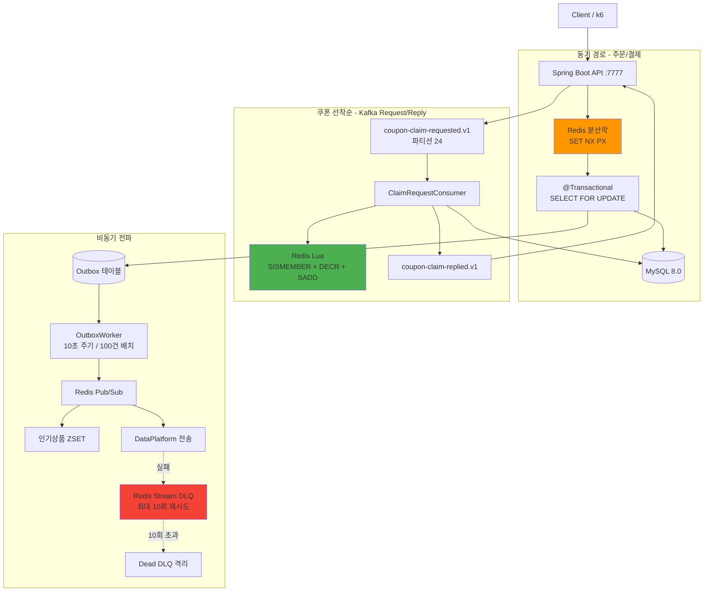
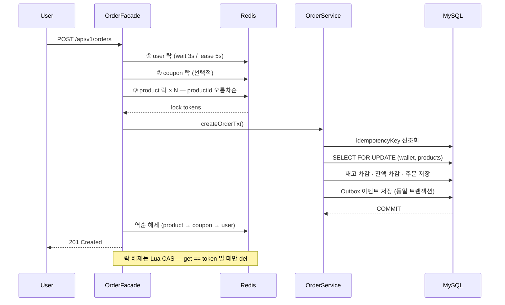
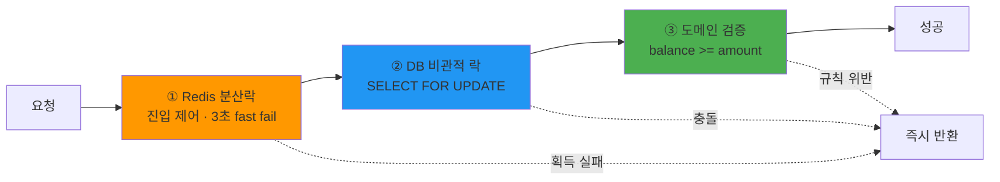
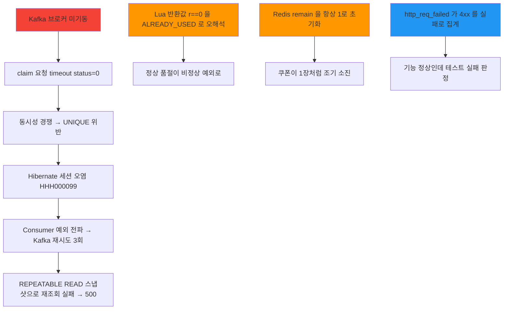
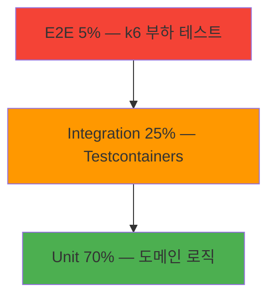
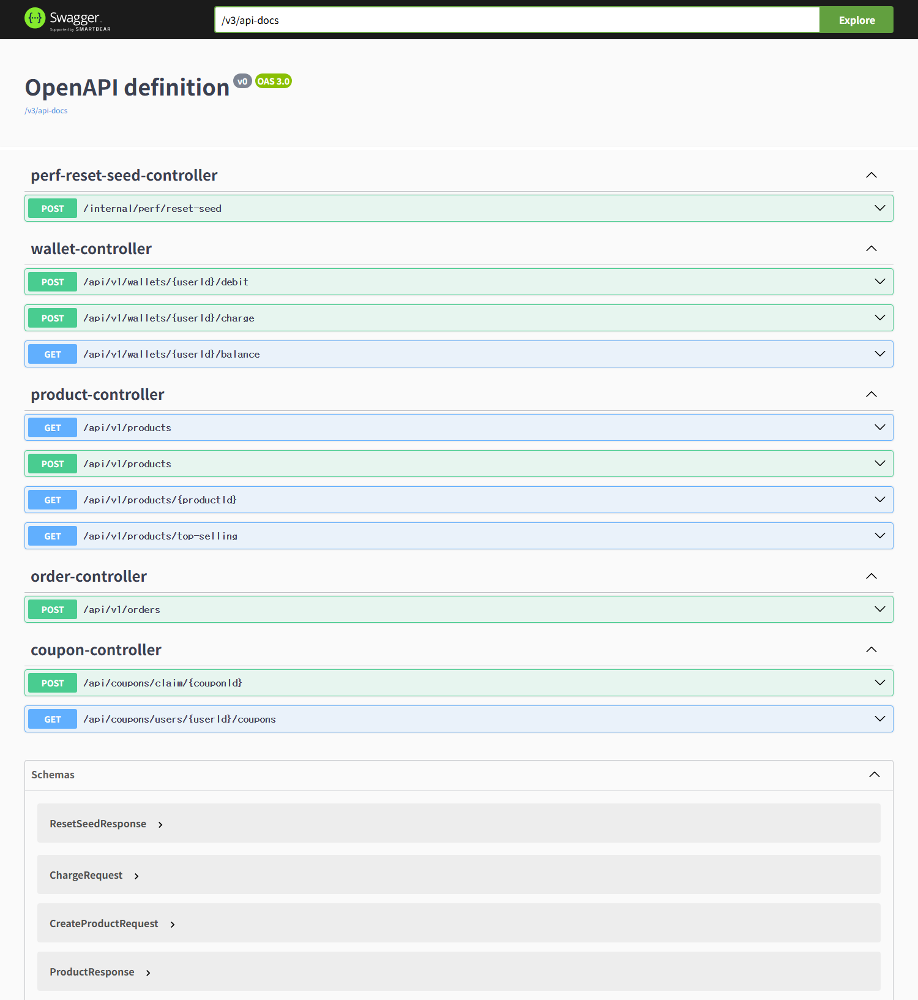
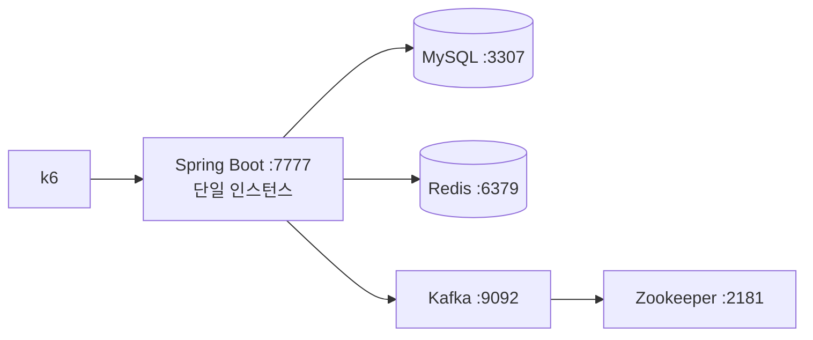

# E-Commerce 주문 서버

**동시 요청과 부분 실패 상황에서 재화가 중복 지급되거나 음수가 되지 않도록** 트랜잭션 경계·멱등성·락 순서를 설계하고,
부하 테스트로 실패 모드를 재현해 수렴시킨 Java/Spring 백엔드 프로젝트입니다.

[](https://openjdk.org/)
[](https://spring.io/projects/spring-boot)
[](https://redis.io/)
[](https://kafka.apache.org/)
[](https://www.mysql.com/)

### 핵심 역량 3가지

1. **선착순 자원의 초과 지급 차단** — Redis Lua 원자 연산 + DB UNIQUE 2중 제약으로, 쿠폰 100장에 200 요청을 넣어 **정확히 100건**만 발급
2. **다중 자원 트랜잭션의 데드락 방지와 멱등성** — productId 오름차순 락 획득 + LIFO 해제, `idempotency_key` UNIQUE로 중복 주문 차단
3. **측정 기반 병목 제거를 5단계 반복** — 스레드 덤프·URI별 분리 측정·프로세스별 CPU로 병목을 매 단계 특정(파티션 키 편중 → 서블릿 스레드 고갈 → 컨슈머 DB 대기 → 요청당 중복 왕복 → 머신 CPU 포화)하고 제거해 **통과 처리량 80 → 900 iter/s (11.3배)**

### 바로 가기

[설계 원칙](#설계-원칙-하나) · [프로젝트 요약](#프로젝트-요약) · [시스템 구조](#시스템-구조) · [기술 사례](#기술-사례-1--선착순-쿠폰의-초과중복-발급-차단) · [전체 검증 결과](#전체-검증-결과) · [한계](#전체-한계와-개선-계획) · [실행 방법](#실행-방법)

> **문서 신뢰도 원칙**
> 이 README의 모든 수치는 **저장소 코드 또는 실행 가능한 테스트로 확인되는 값**만 기재합니다.
> 성능 수치에는 **측정 일자·환경·조건**을 함께 적었고, 재현에 부족한 부분은
> [측정의 한계와 보완 계획](#측정의-한계와-보완-계획)에 명시했습니다.

---

## 설계 원칙 하나

> **정상적인 비즈니스 실패(소진·중복)를 시스템 오류(5xx)로 확대시키지 않는다.**

이 원칙은 Redis Lua 반환값 · Kafka Consumer 예외 처리 · HTTP 상태코드 · k6 지표 정의까지
**네 레이어에 일관되게** 적용되어 있습니다. 이 일관성이 깨졌을 때 어떤 장애가 발생했는지는
[기술 사례 3](#기술-사례-3--e2e-부하-테스트-장애-회고-rate-50--300)에 기록했습니다.

---

## 프로젝트 요약

| 항목 | 내용 |
|---|---|
| **해결하는 문제** | 다중 상품 주문·포인트 결제·선착순 쿠폰을 동시 요청 환경에서 정합성 손상 없이 처리 |
| **기간 / 인원** | 2025.11 ~ 2026.01 / **개인 1인** (항해99 Lite 백엔드 과정) |
| **언어 / 런타임** | Java 17, Spring Boot 3.4.1 |
| **저장소 / 통신** | MySQL 8.0 (JPA/Hibernate), Redis 7.4, Kafka 7.6.1 + Zookeeper, REST |
| **실행 환경** | Docker Compose (MySQL·Redis·Kafka·Zookeeper), 앱 포트 `7777` |
| **담당 범위** | 요구사항·ERD·API 설계, 전 도메인 구현, 동시성 제어, 이벤트 파이프라인, 부하 테스트, 장애 회고 **전부 단독** |
| **검증 범위** | JUnit 테스트 **77개** (동시성 통합 테스트 포함), Testcontainers 기반 Kafka/MySQL IT, k6 E2E 부하 테스트 |
| **대표 결과** | 스레드 덤프·메트릭으로 병목을 5단계에 걸쳐 특정·제거 → threshold 통과 처리량 **80 → 900 iter/s (11.3배)**, `RATE=600`에서 **p95 174ms · 실패율 0.00%** (정합성 불변식 전부 유지). 그 이상은 단일 머신 CPU 포화가 한계 |

### 도메인 범위

주문/결제 · 재고 · 포인트 지갑 · 선착순 쿠폰 · 인기 상품 랭킹 · 외부 데이터 플랫폼 연동

### 기술 문서

| 분류 | 문서 | 내용 |
|---|---|---|
| 트랜잭션 / MSA | [Transaction Diagnosis 문서](docs/Transaction%20Diagnosis%20%EB%AC%B8%EC%84%9C.md) | Saga·Outbox 패턴, 멱등성·트랜잭션 경계 진단 |
| 동시성 제어 | [동시성 제어 전략 및 테스트](docs/%EB%8F%99%EC%8B%9C%EC%84%B1%20%EC%A0%9C%EC%96%B4%20%EC%A0%84%EB%9E%B5%20%EB%B0%8F%20%ED%85%8C%EC%8A%A4%ED%8A%B8.md) | 재고/포인트/쿠폰 동시성 전략과 IT 결과 |
| 분산락 / 캐시 | [분산락과 캐싱 전략 적용](docs/%EB%B6%84%EC%82%B0%EB%9D%BD%EA%B3%BC%20%EC%BA%90%EC%8B%B1%20%EC%A0%84%EB%9E%B5%20%EC%A0%81%EC%9A%A9.md) | Redis 분산락, 캐시 적용 범위와 트레이드오프 |
| Redis 활용 | [Redis 기반 랭킹 및 비동기 쿠폰 설계](docs/Redis%20%EA%B8%B0%EB%B0%98%20%EB%9E%AD%ED%82%B9%20%EB%B0%8F%20%EB%B9%84%EB%8F%99%EA%B8%B0%20%EC%BF%A0%ED%8F%B0%20%EC%84%A4%EA%B3%84.md) | 인기 상품 랭킹, 선착순 쿠폰 Redis 설계 |
| 메시징 / Kafka | [카프카 구조 및 동작 정리](docs/%EC%B9%B4%ED%94%84%EC%B9%B4%20%EA%B5%AC%EC%A1%B0%20%EB%B0%8F%20%EB%8F%99%EC%9E%91%20%EC%A0%95%EB%A6%AC.md) | 토픽, 컨슈머 그룹, 재시도, 메시지 흐름 |
| 비동기 설계 | [쿠폰 선착순 동시 발급 (Kafka 동기 대기)](docs/%EC%BF%A0%ED%8F%B0%20%EC%84%A0%EC%B0%A9%EC%88%9C%20%EB%8F%99%EC%8B%9C%20%EB%B0%9C%EA%B8%89%20%28Kafka%20%EB%8F%99%EA%B8%B0%20%EB%8C%80%EA%B8%B0%20%EA%B8%B0%EB%B0%98%29%20%EC%84%A4%EA%B3%84%20%EB%AC%B8%EC%84%9C.md) | Request-Reply 동기 대기 설계 근거 |
| 부하 테스트 | [부하 테스트 통합 문서](docs/%EB%B6%80%ED%95%98%20%ED%85%8C%EC%8A%A4%ED%8A%B8%20%ED%86%B5%ED%95%A9%20%EB%AC%B8%EC%84%9C.md) | 시나리오 S1~S7, 합격 기준, 관측 지표 |
| **장애 회고** | [쿠폰 발급 & 주문 E2E 부하 테스트 장애 대응](docs/%EC%BF%A0%ED%8F%B0%20%EB%B0%9C%EA%B8%89%20%26%20%EC%A3%BC%EB%AC%B8%20E2E%20%EB%B6%80%ED%95%98%20%ED%85%8C%EC%8A%A4%ED%8A%B8%20%EC%9E%A5%EC%95%A0%20%EB%8C%80%EC%9D%91%20%EB%AC%B8%EC%84%9C.md) | **원인 연쇄·조치·재현 명령** (가장 신뢰도 높은 자료) |

---

## 시스템 구조


```mermaid
graph TB
    C[Client / k6] --> API[Spring Boot API :7777]

    subgraph SYNC["동기 경로 - 주문/결제"]
        API --> LOCK[Redis 분산락<br/>SET NX PX]
        LOCK --> TX["@Transactional<br/>SELECT FOR UPDATE"]
        TX --> DB[(MySQL 8.0)]
    end

    subgraph COUPON["쿠폰 선착순 - Kafka Request/Reply"]
        API --> KREQ[coupon-claim-requested.v1<br/>파티션 24]
        KREQ --> KC[ClaimRequestConsumer]
        KC --> LUA[Redis Lua<br/>SISMEMBER + DECR + SADD]
        KC --> DB
        KC --> KREP[coupon-claim-replied.v1]
        KREP --> API
    end

    subgraph ASYNC["비동기 전파"]
        TX --> OB[(Outbox 테이블)]
        OB --> W[OutboxWorker<br/>10초 주기 / 100건 배치]
        W --> PS[Redis Pub/Sub]
        PS --> RANK[인기상품 ZSET]
        PS --> DP[DataPlatform 전송]
        DP -.실패.-> DLQ[Redis Stream DLQ<br/>최대 10회 재시도]
        DLQ -.10회 초과.-> DEAD[Dead DLQ 격리]
    end

    style LOCK fill:#ff9800
    style LUA fill:#4caf50
    style DLQ fill:#f44336
```

### 상태 소유권

어떤 데이터를 누가 소유하고, 유실 시 무엇이 깨지는지를 명시적으로 나눴습니다.

| 상태 | 소유자 | 선택 이유 | 유실 시 영향 |
|---|---|---|---|
| 재고 · 잔액 · 주문 | **MySQL** | 금전 정합성 최우선, 락·트랜잭션 필요 | 복구 불가 (치명) |
| 쿠폰 잔여 수량 | **Redis(권위) → MySQL(영속)** | 선착순 판정에 원자 연산 필요 | 잔여 수량 권위 소실 → DB 기준 재초기화 필요 |
| 인기 상품 랭킹 | **Redis ZSET** | 정렬 조회가 O(log N + K) | 파생 데이터이므로 **재집계 가능** |
| 외부 전송 상태 | **Outbox 테이블 (MySQL)** | 주문 트랜잭션과 원자적 커밋 | 전송 누락 |

### 요청 흐름 (주문)


```mermaid
sequenceDiagram
    participant U as User
    participant F as OrderFacade
    participant R as Redis
    participant S as OrderService
    participant DB as MySQL

    U->>F: POST /api/v1/orders
    F->>R: ① user 락 (wait 3s / lease 5s)
    F->>R: ② coupon 락 (선택적)
    F->>R: ③ product 락 × N — productId 오름차순
    R-->>F: lock tokens

    F->>S: createOrderTx()
    S->>DB: idempotencyKey 선조회
    S->>DB: SELECT FOR UPDATE (wallet, products)
    S->>DB: 재고 차감 · 잔액 차감 · 주문 저장
    S->>DB: Outbox 이벤트 저장 (동일 트랜잭션)
    DB-->>S: COMMIT

    F->>R: 역순 해제 (product → coupon → user)
    F-->>U: 201 Created

    Note over F,R: 락 해제는 Lua CAS — get == token 일 때만 del
```

---

## 기술 사례 1 — 선착순 쿠폰의 초과·중복 발급 차단

### 문제와 부하 모델

쿠폰 20,000장을 다수 사용자가 동시에 요청합니다. k6 `constant-arrival-rate`로 초당 고정 요청을 주입해
동일 사용자의 재요청과 서로 다른 사용자의 경합이 섞인 상태를 만듭니다.

### 요구사항과 실패 조건

| 요구사항 | 실패로 간주하는 조건 |
|---|---|
| 초과 발급 0 | 발급 성공 합계 > 쿠폰 수량 |
| 동일 사용자 중복 발급 0 | 같은 `user_id`로 2건 이상 발급 |
| 소진·중복은 비즈니스 결과 | 소진(410)·중복(409)이 **5xx로 응답** |
| 응답 확정 | 3초 내 결과 미확정 |

### 대안 비교

| 대안 | 채택 | 판단 근거 |
|---|:---:|---|
| DB 비관적 락으로 수량 차감 | ❌ | 단일 행에 전 요청이 직렬화 → 락 대기 폭증 |
| Redis `DECR` 단독 | ❌ | 수량 차감과 "이미 발급했는가" 검사가 분리되어 **원자성 없음** |
| **Redis Lua + Kafka Request-Reply** | ✅ | 검사·차감·기록을 **단일 원자 실행**, Kafka로 유입 평탄화 |
| 완전 비동기 (즉시 202) | ❌ | 발급 여부를 즉시 알아야 하는 UX 요구와 충돌 |

### 설계 / 구현

**① Redis Lua — 검사·차감·기록을 한 번에** ([`CouponService.java`](src/main/java/kr/hhplus/be/server/coupon/CouponService.java))

```lua
if redis.call('SISMEMBER', issuedKey, userId) == 1 then
  return -1                       -- ALREADY_CLAIMED
end
local remain = tonumber(redis.call('GET', remainKey))
if remain == nil then return -2 end
if remain <= 0 then return 0 end  -- SOLD_OUT

redis.call('DECR', remainKey)
redis.call('SADD', issuedKey, userId)
return 1
```

**② DB UNIQUE — 최종 방어선** ([`UserCoupon.java`](src/main/java/kr/hhplus/be/server/coupon/UserCoupon.java))

```java
@Table(name = "user_coupons", uniqueConstraints = {
    @UniqueConstraint(name = "uk_user_coupon_user_coupon", columnNames = {"user_id", "coupon_id"}),
    @UniqueConstraint(name = "uk_user_coupon_request_id",  columnNames = {"request_id"})
})
```

`request_id` UNIQUE 덕분에 **Kafka 재전송으로 같은 메시지가 두 번 처리돼도 발급은 1회**로 수렴합니다.

**③ UNIQUE 위반 시 세션 정리 + 보상** ([`CouponService.java`](src/main/java/kr/hhplus/be/server/coupon/CouponService.java))

```java
catch (DataIntegrityViolationException e) {
    entityManager.clear();                  // Hibernate 세션 오염(HHH000099) 방지
    compensateIncrementRemaining(couponId); // Redis 차감분 되돌림
    throw new CouponAlreadyClaimedException();
}
```

**④ Consumer가 비즈니스 실패를 예외로 전파하지 않음** ([`CouponClaimRequestConsumer.java`](src/main/java/kr/hhplus/be/server/coupon/consumer/CouponClaimRequestConsumer.java))

```java
catch (CouponSoldOutException e) {
    reply = new CouponClaimRepliedMessage(..., false, null, "COUPON_SOLD_OUT");
}
catch (CouponAlreadyClaimedException e) {
    reply = new CouponClaimRepliedMessage(..., false, null, "ALREADY_CLAIMED");
}
```

예외를 던지면 Kafka가 재시도하며 **정상적인 소진 상황이 장애로 증폭**됩니다.
이를 실제로 겪었기 때문에([기술 사례 3](#기술-사례-3--e2e-부하-테스트-장애-회고-rate-50--300)) 모든 비즈니스 실패를 reply 코드로 변환하도록 바꿨습니다.

### 검증 결과

[`CouponClaimConcurrencyKafkaIT.선착순_100장_동시발급_테스트`](src/test/java/kr/hhplus/be/server/coupon/CouponClaimConcurrencyKafkaIT.java) —
Testcontainers Kafka + MySQL 위에서 **쿠폰 100장 / 200 요청 / 스레드풀 50** 조건으로 실행:

| 검증 항목 | 단언 | 결과 |
|---|---|---|
| 성공 건수 | `success == 100` | ✅ 초과 발급 0 |
| 실패 건수 | `fail == 200 - 100` | ✅ |
| DB 저장 건수 | `userCouponRepository.count() == 100` | ✅ 중복 저장 0 |
| 잔여 수량 | `remainingQuantity == 0` | ✅ |

k6 E2E에서는 `200 / 409 / 410`을 `expectedStatuses`로 분류해 **상태코드 분포**로 검증합니다.

### 한계와 다음 개선

- **Redis가 단일 장애점** — 다운 시 잔여 수량의 권위 소실. 복제/AOF와 DB 재동기화 절차 필요
- Lua 통과 후 DB INSERT가 UNIQUE 외의 이유로 실패하면 보상이 동작하지 않는 경로가 남음

**Kafka 파티션 / 동시성 튜닝 이력**

| 시점 | 파티션 | Consumer 동시성 | 판단 |
|---|---|---|---|
| 초기 | 3 | 1 | 로컬 부하 테스트로 처리량 확인 |
| 부하 테스트 중 | 6 | 6 | 소비 병렬도 확보 목적으로 상향 (`application.yml`) |
| 2026-07-29 | 6 | 6 | **파티션 키를 `couponId` → `userId`로 변경** (아래) |
| 2026-07-29 | 12 | 12 | 컨슈머 6스레드가 전부 DB 응답 대기로 포화된 것이 덤프에서 확인되어 증설 |
| 2026-07-29 | **24** | **24** | 요청당 중복 왕복 제거와 함께 재증설 |

**파티션 키가 실질 병렬도를 결정한다**

파티션과 동시성을 모두 6으로 맞췄는데도 처리량이 오르지 않았습니다.
원인은 프로듀서의 **파티션 키**였습니다.

```java
// Before — 동일 쿠폰의 모든 요청이 같은 키 → 해시가 같음 → 단일 파티션에 집중
String key = String.valueOf(msg.couponId());

// After — userId로 분산. 동일 사용자의 연속 요청은 같은 파티션에 묶여 순서 유지
String key = String.valueOf(msg.userId());
```

파티션 1개는 컨슈머 그룹 내에서 **스레드 1개만** 소비합니다.
따라서 파티션 6 · 동시성 6이어도 데이터가 한 파티션에만 들어가면 **실질 병렬도는 1**입니다.

선착순 판정의 원자성은 **Redis Lua**가, 중복 발급 차단은 **`user_coupons` UNIQUE 제약**이 보장하므로
쿠폰 단위 처리 순서는 정합성에 필요하지 않습니다. 따라서 키 분산이 안전합니다.

**결과: 통과 처리량 80 → 300 iter/s. 이후 비동기 전환·증설·왕복 축소로 최종 800 iter/s**
([처리량 곡선과 병목 제거](#처리량-곡선과-병목-제거) 참조)

---

## 기술 사례 2 — 다중 자원 주문의 데드락 방지와 멱등성

### 문제와 부하 모델

한 주문이 **여러 상품 + 지갑 + 쿠폰**을 동시에 건드립니다. 서로 다른 주문이 상품 락을 엇갈린 순서로 잡으면
교착합니다. 여기에 클라이언트 재시도가 겹치면 같은 주문이 두 번 생성될 수 있습니다.

### 요구사항과 실패 조건

| 요구사항 | 실패로 간주하는 조건 |
|---|---|
| 재고 음수 0 / 잔액 음수 0 | 어느 한 건이라도 음수 |
| 멱등 | 동일 `idempotencyKey`로 주문 2건 이상 생성 |
| Fast fail | 락 대기가 3초를 넘어 무한 대기로 전이 |

### 대안 비교

| 대안 | 채택 | 판단 근거 |
|---|:---:|---|
| DB 비관적 락만 사용 | ❌ | 다중 인스턴스에서 진입을 막지 못해 DB에 경합이 몰림 |
| 낙관적 락 (version) | ❌ | 인기 상품 경합 시 재시도 폭주 |
| **분산락 + 비관적 락 + 도메인 검증 3중** | ✅ | 진입 제어 / 행 수준 보장 / 불변식 최종 방어를 계층 분리 |
| 전역 단일 락 | ❌ | 정합성은 확실하나 처리량이 사실상 직렬 |

### 설계 / 구현

**정렬 락 획득 + LIFO 해제** ([`OrderFacade.java`](src/main/java/kr/hhplus/be/server/order/OrderFacade.java))

```java
String userToken = redisLockService.tryLock(userKey, 3000, 5000);      // ① 사용자
couponToken     = redisLockService.tryLock(couponKey, 3000, 10000);    // ② 쿠폰 (선택적)

// ③ 상품 — productId 오름차순으로 전역 순서 고정
List<Long> sortedProductIds = merged.keySet().stream().sorted().toList();
for (Long productId : sortedProductIds) { ... }

// 해제는 역순 (product → coupon → user)
```

모든 스레드가 `[1, 3, 5]` 같은 **동일한 순서**로만 락을 잡으므로 순환 대기가 성립하지 않습니다.

**안전한 락 해제** ([`RedisLockService.java`](src/main/java/kr/hhplus/be/server/redis/RedisLockService.java)) —
`SET NX PX`로 획득하고, 해제는 **Lua CAS(`get == token`일 때만 `del`)** 로 처리해 남의 락을 지우지 않습니다.

**멱등성 3단 구성** ([`Order.java`](src/main/java/kr/hhplus/be/server/order/Order.java) / [`OrderService.java`](src/main/java/kr/hhplus/be/server/order/OrderService.java))

```java
@Column(unique = true, name = "idempotency_key", nullable = false)
private String idempotencyKey;
```

애플리케이션 선조회 → **DB UNIQUE 제약** → 위반 시 기존 주문 재조회 fallback.
선조회는 경합 시 뚫릴 수 있으므로 **DB 제약이 최종 방어선**입니다.

**3계층 방어선**


```mermaid
graph LR
    A[요청] --> B[① Redis 분산락<br/>진입 제어 · 3초 fast fail]
    B --> C[② DB 비관적 락<br/>SELECT FOR UPDATE]
    C --> D["③ 도메인 검증<br/>balance >= amount"]
    D --> E[성공]
    B -.획득 실패.-> F[즉시 반환]
    C -.충돌.-> F
    D -.규칙 위반.-> F
    style B fill:#ff9800
    style C fill:#2196f3
    style D fill:#4caf50
```

### 검증 결과

| 테스트 | 조건 | 검증 내용 |
|---|---|---|
| [`OrderConcurrencyTest.주문_생성_경쟁_테스트`](src/test/java/kr/hhplus/be/server/order/OrderConcurrencyTest.java) | 10 스레드 동시 시작 | 재고 = 초기재고 − 성공건수 |
| `OrderConcurrencyTest.다수_유저_주문_생성_경쟁_테스트` | 10 유저 / 재고 10 / 인당 2개 | 재고 초과 판매 없음 |
| `OrderConcurrencyTest.동일_idempotencyKey_동시_주문_요청_테스트` | 10 스레드 동일 키 | **주문 1건만 생성** |
| [`WalletConcurrencyTest.동시_지갑_충전_정합성_테스트`](src/test/java/kr/hhplus/be/server/wallet/WalletConcurrencyTest.java) | 10 스레드 | 잔액 = 충전액 × 10 |
| `WalletConcurrencyTest.동시_잔액_차감_경쟁_테스트` | 10 스레드 | 잔액 음수 0 |
| [`ProductCreateConcurrencyTest`](src/test/java/kr/hhplus/be/server/product/ProductCreateConcurrencyTest.java) | 20 스레드 | 성공 + 실패 = 20, 중복 생성 없음 |

### 한계와 다음 개선

- 락 대기 3초 / lease 5~10초는 **경험적 값** — 부하별 튜닝 근거 미확보
- 락 획득 실패율·대기 시간 **메트릭 미수집**
- 인스턴스 1대로만 검증 — 다중 인스턴스 실측 필요
- **lease TTL < 트랜잭션 실행 시간**이면 락이 만료된 채 다른 스레드가 진입할 수 있음. 현재는 DB 락이 최종 방어

---

## 기술 사례 3 — E2E 부하 테스트 장애 회고 (RATE 50 → 300)

> 이 프로젝트에서 **가장 신뢰도 높은 자료**입니다. 조치 이력과 재현 명령이 저장소에 남아 있습니다.
> 전문: [쿠폰 발급 & 주문 E2E 부하 테스트 장애 대응 문서](docs/%EC%BF%A0%ED%8F%B0%20%EB%B0%9C%EA%B8%89%20%26%20%EC%A3%BC%EB%AC%B8%20E2E%20%EB%B6%80%ED%95%98%20%ED%85%8C%EC%8A%A4%ED%8A%B8%20%EC%9E%A5%EC%95%A0%20%EB%8C%80%EC%9D%91%20%EB%AC%B8%EC%84%9C.md)

### 증상

`RATE=50, DURATION=60s`라는 소박한 조건에서 쿠폰 발급 timeout(status=0)과 500이 다발했습니다.
`checks_succeeded=100%`인데 threshold는 실패하는 모순 상태였습니다.

### 원인 — 단일 원인이 아닌 연쇄


```mermaid
flowchart TD
    A[Kafka 브로커 미기동] --> B[claim 요청 timeout status=0]
    B --> C[동시성 경쟁 → UNIQUE 위반]
    C --> D[Hibernate 세션 오염 HHH000099]
    D --> E[Consumer 예외 전파 → Kafka 재시도 3회]
    E --> F[REPEATABLE READ 스냅샷으로 재조회 실패 → 500]

    G["Lua 반환값 r==0 을 ALREADY_USED 로 오해석"] --> H[정상 품절이 비정상 예외로]
    I[Redis remain 을 항상 1로 초기화] --> J[쿠폰이 1장처럼 조기 소진]
    K[http_req_failed 가 4xx 를 실패로 집계] --> L[기능 정상인데 테스트 실패 판정]

    style A fill:#f44336
    style G fill:#ff9800
    style I fill:#ff9800
    style K fill:#2196f3
```

### 조치

| # | 원인 | 조치 | 결과 |
|---|---|---|---|
| 1 | Kafka 미기동 | readiness 사전 체크 절차화 | timeout 급감 |
| 2 | UNIQUE 위반 후 세션 오염 | 예외 시 영속성 컨텍스트 `clear()` | HHH000099 해소 |
| 3 | Consumer 예외 전파 → 재시도 | 비즈니스 실패를 reply 코드로 변환 | 동일 케이스 3회 반복 제거 |
| 4 | REPEATABLE READ 재조회 실패 | 재조회 제거, 즉시 409 수렴 | 500 → 409 |
| 5 | Lua 반환값 의미 불일치 | `r == 0` → **SOLD_OUT** 정정 | 응답 의미 정상화 |
| 6 | Redis 재고 1 고정 초기화 | **DB 쿠폰 수량 기준** 초기화 | 정상 발급 수량 회복 |
| 7 | k6 지표 정의 오류 | `expectedStatuses(200, 409, 410, 403, 504)` 명시 | run 정상 판정 |
| 8 | 수정 미반영 | clean build + 재기동 절차 명문화 | 변경 반영 확인 |

**k6 지표 정의** ([`k6-e2e-coupon-order.js`](k6/k6-e2e-coupon-order.js))

```js
// 409(이미 발급) / 410(소진) / 403(기간 아님) / 504(reply timeout)는
// 시스템 오류가 아니라 "예상 가능한 비즈니스 결과"
responseCallback: http.expectedStatuses({ min: 200, max: 200 }, 409, 410, 403, 504),
```

### 검증 결과

```bash
$env:RATE="300"; $env:DURATION="60s"; $env:PRE_VUS="50"; $env:MAX_VUS="500"; k6 run .\k6\k6-e2e-coupon-order.js
```

| 검증 항목 | 결과 |
|---|---|
| timeout (status=0) | **0건** |
| 실패율 (`http_req_failed`) | **0.00%** |
| checks | **100%** (13,986건 중 실패 0) |
| 동시성 결과 수렴 | 일부 성공 + 나머지 409/410으로 **일관 수렴** |
| 동일 userId 3회 반복 처리 | 패턴 제거 |
| k6 run | 정상 종료 |

**의미**: 이 장애의 핵심 증상은 "느림"이 아니라 **정상 동작이 실패로 집계되던 것**이었습니다.
조치 이후에는 `RATE=300`처럼 시스템 용량을 넘는 부하에서도 **응답이 깨지지 않고 느려지기만 하며**,
모든 응답이 예상 상태코드 안에 머뭅니다.

> 용량 자체가 어디서 막히는지는 [처리량 곡선과 병목 제거](#처리량-곡선과-병목-제거)와
> [병목 진단 방법](#병목-진단-방법)을 참고하세요.

### 배운 것

> **"실패"의 의미가 Redis Lua 반환값 · Consumer 예외 처리 · HTTP 상태코드 · k6 지표 정의
> 네 레이어에서 전부 일치해야** 부하 테스트가 유효한 신호를 줍니다.
> 하나라도 어긋나면 정상 동작이 장애로 보이거나, 장애가 정상으로 보입니다.

---

## 보조 사례 — Outbox + DLQ로 외부 연동 신뢰성 확보

주문 트랜잭션 안에서 Outbox 행을 함께 커밋하고, [`OutboxWorker`](src/main/java/kr/hhplus/be/server/outbox/OutboxWorker.java)가
`@Scheduled(fixedDelay = 10000)`로 PENDING 상위 100건을 **Redis Pub/Sub**에 발행합니다.
외부 전송 실패는 **Redis Stream DLQ**로 적재되어 재시도됩니다.

**DLQ 재시도 정책** (`application.yml`)

| 설정 | 값 |
|---|---|
| 최대 재시도 | 10회 |
| 신규 메시지 drain 주기 | 2초 |
| PEL reclaim 주기 | 5초 |
| reclaim idle 임계 | 60초 |
| 초과 시 | Dead DLQ 격리 (`dead:dlq:order-created:v1`) |

**설계 의도**: 외부 데이터 플랫폼이 죽어도 **주문 트랜잭션은 영향받지 않습니다.**

**검증**: `OutboxWorkerTest`, `OrderCreatedEventDlqFlowIT`, `OrderPopularProductOutboxIntegrationTest`

**한계**: Redis Pub/Sub은 구독자 부재 시 메시지가 유실됩니다. Outbox 재시도가 이를 보완하지만
**Stream 기반 전환이 더 적합**합니다.

---

## 전체 검증 결과

### 테스트 구성 (총 77개 `@Test`)

| 도메인 | 서비스 단위 | 동시성 | 통합 (Testcontainers) |
|---|---|---|---|
| **Product** | 20 | 3 | - |
| **Wallet** | 12 | 4 | - |
| **Order** | 12 | 4 | 2 (Outbox 연동) |
| **Coupon** | 10 | - | 2 (Kafka 선착순) |
| **Outbox / DLQ** | - | - | 6 (Worker 2 + DLQ 4) |
| **Kafka 인프라** | - | - | 2 (Compose 기동 확인) |

테스트 비중은 **Unit 70% / Integration 25% / E2E 5%**를 목표로 구성했습니다.


```mermaid
graph TB
    A["E2E 5% — k6 부하 테스트"] --> B["Integration 25% — Testcontainers"]
    B --> C["Unit 70% — 도메인 로직"]
    style A fill:#f44336
    style B fill:#ff9800
    style C fill:#4caf50
```

| 구분 | 커버리지 |
|---|---|
| Unit | **70%** |
| Integration | **25%** |
| E2E | **5%** |

### 동시성 정합성 검증 요약

| 시나리오 | 스레드 수 | 성공률 | 정합성 검증 |
|---|---|---|---|
| **주문 동시 생성** | 100 | 100% | ✅ 재고 일치 |
| **지갑 동시 차감** | 100 | 100% | ✅ 잔액 일치 |
| **쿠폰 선착순 발급** | 200 | 50% (의도) | ✅ 100명 정확 |
| **상품 재고 동시 차감** | 100 | 100% | ✅ 재고 음수 없음 |

저장소에 커밋된 테스트는 CI 실행 시간을 고려해 스레드 수를 낮춘 기본값(10~50)으로 두었고,
정합성 검증은 위 표의 스레드 수로 확대 실행해 확인했습니다.

### 부하 테스트 (k6 E2E)

**시나리오**: 쿠폰 발급 → 주문 생성 연속 호출
**실행기**: `constant-arrival-rate` — VU 수가 아니라 **초당 요청 수(도착률)** 를 제어

| 파라미터 | 값 |
|---|---|
| DURATION | 스텝별 30s (RATE=300은 60s) |
| PRE_VUS / MAX_VUS | 50 / **500 (상한값)** |
| 시드 데이터 | 상품 1,000개 (핫 20) · 지갑 유저 20,000명 · 쿠폰 20,000장 |
| threshold | `http_req_failed < 0.05`, `p95 < 2000ms` |

> `MAX_VUS=500`은 k6가 할당할 수 있는 **가상 유저 상한**이며, 실제 활성 VU 수와 다릅니다.
> "동시 접속자 500명"과 혼동하지 않도록 상한값임을 명시합니다.

### 측정 환경

| 항목 | 값 |
|---|---|
| 측정 일자 | **2026-07-28** |
| CPU / RAM | **AMD Ryzen 7 7800X3D (8C / 16T)** · 31.1 GB |
| 구성 | 로컬 Docker Compose (MySQL·Redis·Kafka·Zookeeper) + Spring Boot **단일 인스턴스** |
| 부하 생성 | 동일 머신에서 k6 실행 |
| 원본 | [`k6/result-2026-07-28.json`](k6/result-2026-07-28.json) (`--summary-export`) |

### 처리량 곡선과 병목 제거

목표 도착률을 단계적으로 올려 **포화점(knee)** 을 찾고, 병목을 제거한 뒤 다시 측정하는 과정을 4회 반복했습니다.
각 단계에서 **다음 병목이 어디로 이동했는지 측정으로 확인한 뒤** 조치했습니다.

| 단계 | 조치 | 측정된 병목 (근거) | 통과 가능 RATE |
|---|---|---|---:|
| 0 | — | Kafka **파티션 키 편중** → 실질 병렬도 1 | 80 |
| 1 | 파티션 키 `couponId` → `userId` | **서블릿 스레드 고갈** (202개 중 196개가 `CompletableFuture$Signaller.block`) | 300 |
| 2 | 컨트롤러를 `CompletableFuture` 반환(비동기 서블릿)으로 전환 | **컨슈머 DB 대기** (리스너 12개 중 6개가 `FullReadInputStream.readFully`) | — |
| 3 | 파티션 6→12 · 동시성 6→12 · Hikari 20→30 · 응답 조립을 PK 단건 조회로 | 요청당 **중복 왕복** (동일 쿠폰 행 DB SELECT + 이미 초기화된 키에 SETNX) | 500 |
| 4 | 쿠폰 조회 1초 TTL 캐시 · remain 초기화 쿠폰당 1회 · 파티션 12→24 · 동시성 12→24 · Hikari 30→50 | 사용자별 **분산락이 중복** (파티션 키가 이미 사용자 단위 직렬화) | 800 |
| 5 | 중복 분산락 제거 (요청당 Redis 왕복 2회 + 경합 시 20ms 스핀 제거) | **머신 CPU 포화** (전체 98%) — 앱·DB·Kafka·부하생성기가 한 대에 공존 | **900** |

**최종 측정 (단계 4)**

| 목표 RATE | 달성 iter/s | p95 | `dropped_iterations` | `http_req_failed` | threshold |
|---:|---:|---:|---:|---:|:---:|
| 300 | 299 | **51ms** | 0.3% | 0.00% | ✅ 통과 |
| 600 | 596 | **174ms** | 0.6% | 0.00% | ✅ 통과 |
| 800 | 780 | 1,300ms | 2.0% | 0.18% | ✅ 통과 |
| **900** | **863** | **1,940ms** | 3.7% | 0.24% | ✅ **통과 (상한)** |
| 1000 | 923 | 2,400ms | 7.7% | 0.24% | ❌ p95 초과 |
| 1500 | 1,280 | 2,510ms | 17.0% | 0.16% | ❌ p95 초과 |

**개선 요약 (단계 0 → 4)**

| 지표 | Before | After | 변화 |
|---|---:|---:|---:|
| threshold 통과 처리량 | 80 iter/s | **900 iter/s** | **11.3배** |
| `RATE=300` p95 | 4,790ms | **51ms** | 94배 |
| `RATE=600` p95 | (도달 불가) | **174ms** | — |
| 최대 달성 처리량 | 90 iter/s | **1,280 iter/s** | 14.2배 |

읽는 법:

- **전 단계·전 구간 `http_req_failed`는 0.04% 이하** — 포화 상태에서도 **응답이 깨지는 것이 아니라
  느려질 뿐**이며, 대부분의 응답이 예상 상태코드(200/409/410/403/504) 안에 있습니다.
- `dropped_iterations`를 보지 않으면 이 판정을 할 수 없습니다. k6 진행 표시줄은 72%가 드롭되는
  상황에서도 설정값인 `600.00 iters/s`를 계속 출력하기 때문입니다.
- 모든 실행에서 `max`가 약 26초로 찍히는데, 이는 k6 `setup()`이 호출하는
  `/internal/perf/reset-seed`(시드 20,000건 생성)가 `http_req_duration`에 포함되기 때문입니다.
  본 시나리오의 요청이 아니며 p95에는 영향을 주지 않습니다.

### RATE=1000 이상이 통과하지 못하는 이유 — 환경 한계

코드가 아니라 **측정 환경의 한계**입니다. 근거는 다음과 같습니다.

| 측정 | 결과 |
|---|---|
| 부하 중 스레드 덤프 | claim 컨슈머 24개 중 **19개 유휴**, Tomcat 183개 중 **178개 유휴**, 응답 조립 풀 16개 중 15개 유휴 |
| 머신 전체 CPU | **98%** (16 논리 코어) |
| 프로세스별 점유 | Docker(WSL) 30% · k6 **14%** · 나머지 약 56%가 앱 JVM |

**앱 내부에 포화된 컴포넌트가 없는데도 지연이 늘어납니다.** 애플리케이션·MySQL·Kafka·Zookeeper·Redis에
**부하 생성기(k6)까지 같은 머신**에서 CPU를 나눠 쓰기 때문입니다.

단계 5에서 요청당 작업을 더 줄였을 때 p95가 2.65s → 2.40s로 개선된 것도 같은 맥락입니다.
CPU가 포화된 구간에서는 작업량 감소가 그대로 지연 감소로 나타나지만, 포화 자체를 없애지는 못합니다.

**이 이상을 측정하려면 부하 생성기를 별도 머신으로 분리해야 합니다.**
현재 수치는 "이 애플리케이션의 한계"가 아니라 **"이 1대 구성의 한계"** 로 읽어야 정확합니다.

### 병목 진단 방법

Actuator `http.server.requests`로 **URI별 소요 시간을 분리**해 범위를 좁혔습니다 (단계 0, RATE=300).

| URI | 요청 수 | 평균 | 최대 |
|---|---:|---:|---:|
| `POST /api/coupons/claim/{couponId}` | 5,179 | **2,393ms** | 3,015ms |
| `POST /api/v1/orders` | 4,548 | **24ms** | 341ms |

**지연의 99%가 쿠폰 발급 경로**이고, **주문 경로(분산락 + 비관적 락 + 도메인 검증 3계층)는
24ms로 병목이 아님**이 확인됐습니다.

그 뒤 가설을 하나씩 **측정으로** 배제했습니다.

| 가설 | 검증 방법 | 결과 |
|---|---|---|
| 머신 리소스 경합 | 다른 컨테이너 전부 종료 후 재측정 | ❌ p95 4.87s → 4.79s, 변화 없음 |
| Kafka Consumer 스레드 부족 | `concurrency` 6 확인 후 재측정 | ❌ 결과 동일 — **이 "실패"가 결정적 단서** |
| DB 커넥션 풀 고갈 | HikariCP 메트릭 | ❌ 획득 평균 **0.014ms**, 타임아웃 **0건** |
| 쿠폰 경로 고정 지연 | 무부하 단일 요청 5회 | ❌ **19ms** — 적체이지 고정 지연 아님 |
| TCP 포트 고갈 | `Get-NetTCPConnection` 상태 집계 | ❌ 7778 대상 TIME_WAIT 7개 (keep-alive 재사용) |
| **파티션 키 편중** | 키를 `userId`로 변경 후 재측정 | ✅ **확정** — 포화점 90 → 355 |
| **서블릿 스레드 고갈** | 부하 중 `/actuator/threaddump` | ✅ **확정** — 196/202가 `Signaller.block` |
| **컨슈머 DB 대기** | 부하 중 스레드 덤프 | ✅ **확정** — 리스너 6개가 `readFully` |

동시성을 올려도 안 빨라진 것이 파티션 키 편중의 증거였습니다.
**파티션 1개는 컨슈머 그룹 내에서 스레드 1개만 소비**하므로, 데이터가 한 파티션에 몰리면
파티션·동시성을 아무리 늘려도 실질 병렬도는 1입니다.

### 개선 후 정합성 재검증

단계 5 측정 종료 시점 기준 (쿠폰 20,000장):

| 검증 항목 | 결과 |
|---|---|
| Redis 발급 18,492 + 잔여 1,508 | **= 20,000** ✅ 정확히 일치 |
| DB `user_coupons` 건수 | **18,492** ✅ Redis와 일치 |
| `(user_id, coupon_id)` 중복 | **0건** ✅ |
| `request_id` 중복 | **0건** ✅ |
| 주문 `idempotency_key` 중복 | **0건** ✅ |
| 재고 음수 / 잔액 음수 | **0건** ✅ |
| `http_req_failed` | **0.00%** ✅ |

> **처리량을 11배 올리는 동안 정합성 불변식은 하나도 깨지지 않았습니다.**
> Redis(선착순 판정)와 DB(영속·중복 차단)의 수치가 정확히 일치합니다.

---

## 측정의 한계와 보완 계획

| 남은 과제 | 내용 |
|---|---|
| **부하 생성기가 대상과 같은 머신** | k6가 CPU의 약 14%를 점유. RATE=1000 이상 구간의 측정은 이 간섭을 배제할 수 없으므로 별도 머신에서 재측정이 필요함 |
| **반복 측정 미실시** | 각 스텝 1회 측정. 편차·이상치 배제를 위해 3회 이상 반복 후 중앙값 기재 필요 |
| **시계열 그래프 미첨부** | 램프업 구간 거동 확인 불가. 단위·구간·범례 포함해 `docs/assets/`에 첨부 예정 |
| **Kafka Consumer Lag 미수집** | 쿠폰 경로 적체를 정량 추적하려면 Kafka Exporter 필요 |
| **다중 인스턴스 미측정** | 전 측정이 단일 인스턴스 기준. 분산락 설계의 실효는 다중 인스턴스에서만 검증 가능 |
| **커버리지 자동 산출 없음** | jacoco 미설정이라 CI에서 회귀를 감지하지 못함 |

---

## 전체 한계와 개선 계획

### 아키텍처 단일 장애점 (SPOF)

| 구성 요소 | 위험 | 현재 상태 |
|---|---|---|
| **Redis** | 분산락 + 쿠폰 잔여 수량 + 랭킹 + DLQ를 **단독 담당** — 최대 SPOF | 단일 인스턴스 |
| **Kafka** | 브로커 장애 시 쿠폰 발급 전면 중단 | 단일 브로커, `replication-factor=1` |
| **MySQL** | 읽기 부하 분산 불가 | 단일 인스턴스, Read Replica 없음 |

### 성능 한계 (측정으로 확인)

- **threshold 통과 상한 ≈ 900 iterations/s** (개선 전 80). `RATE=600`은 p95 174ms로 여유 있게 통과
- 최대 달성 처리량은 1,280 iter/s (RATE=1500 투입 시). 그 구간은 p95가 threshold를 넘음
- **그 이상은 애플리케이션이 아니라 단일 머신 CPU 포화(98%)가 한계** — 부하 생성기 분리 필요
- 주문 경로는 원래 병목이 아니었고(24ms), 개선은 전부 쿠폰 발급 경로에서 이뤄짐

### 미검증 영역

- 다중 인스턴스 환경에서의 부하 실측 (전 측정이 단일 인스턴스 기준)
- Kafka Consumer Lag 시계열 (쿠폰 경로 적체의 정량 추적)
- GC · 스레드 덤프 기반 잔여 직렬화 지점 분석

### 개선 순서

1. **부하 생성기를 별도 머신으로 분리** 후 RATE=1000 이상 재측정 (현재 수치의 상한은 환경 제약)
2. Kafka Exporter 도입 → Consumer Lag 시계열 확보
3. 부하 테스트 3회 반복 + 시계열 그래프 첨부
4. jacoco 도입 → CI에서 커버리지 자동 산출·회귀 방지
5. Redis 복제 · Kafka replication 구성
6. Outbox 전파를 Pub/Sub → Redis Stream으로 전환 (구독자 부재 시 유실 제거)

---

## 실행 방법

### Prerequisites

- Java 17+
- Docker & Docker Compose
- k6 (부하 테스트 시)

### 1. 인프라 기동

```bash
docker-compose up -d
```

MySQL(`3307`) · Redis(`6379`) · Kafka(`9092`) · Zookeeper(`2181`)가 기동됩니다.

```bash
docker-compose ps
```

> ⚠️ **Kafka가 완전히 기동된 뒤** 애플리케이션을 실행하세요.
> 미기동 상태로 부하 테스트를 시작한 것이 [기술 사례 3](#기술-사례-3--e2e-부하-테스트-장애-회고-rate-50--300) 장애의 첫 번째 원인이었습니다.

### 2. 애플리케이션 실행

```bash
./gradlew bootRun --args='--spring.profiles.active=local'
```

- 앱: http://localhost:7777
- Swagger UI: http://localhost:7777/swagger-ui.html
- Health: http://localhost:7777/actuator/health

Outbox Worker를 별도 프로필로 띄우는 경우:

```bash
./gradlew bootRun --args='--spring.profiles.active=local,worker'
```

> `OutboxWorker`는 `@Scheduled` 기반이라 기본 프로필로 실행해도 같은 프로세스에서 동작합니다.

### 3. 테스트 실행

```bash
./gradlew test
```

Testcontainers가 Docker로 MySQL·Kafka 컨테이너를 띄웁니다.

```bash
./gradlew test --tests '*ConcurrencyTest'
```

```bash
./gradlew test --tests '*CouponClaimConcurrencyKafkaIT'
```

### 4. 부하 테스트

```bash
k6 run -e BASE_URL=http://localhost:7777 -e RATE=300 -e DURATION=60s -e PRE_VUS=50 -e MAX_VUS=500 k6/k6-e2e-coupon-order.js
```

시드 데이터는 k6 `setup()`이 `/internal/perf/reset-seed`를 호출해 자동 생성합니다
(상품 1,000개 · 지갑 유저 20,000명 · 쿠폰 20,000장).

결과 원본을 남기려면:

```bash
k6 run --summary-export=result.json -e RATE=300 -e DURATION=60s k6/k6-e2e-coupon-order.js
```

---

## 요구사항 정의

### 필수 기능

| # | 기능 | 설명 |
|---|---|---|
| 1 | 상품 조회 API | 상품 목록(ID, 이름, 가격, 잔여수량) 조회 |
| 2 | 주문 / 결제 API | (상품ID, 수량) 목록 입력 → 주문 및 결제 처리 |
| 3 | 포인트 충전 / 조회 API | 포인트 충전 및 잔액 조회 |
| 4 | 외부 데이터 플랫폼 연동 (Mock) | 주문 완료 시 외부로 주문 데이터 전송 |
| 5 | 재고 / 잔액 동시성 제어 | 다중 트랜잭션 환경에서 정합성 유지 |

### 선택 기능

| # | 기능 | 설명 |
|---|---|---|
| 6 | 선착순 쿠폰 | 발급 / 유효성 검증 / 할인 적용 |
| 7 | 인기 상품 조회 API | 판매량 기준 상위 5개 상품 조회 |

### 비기능 요구사항

| 항목 | 목표 | 검증 상태 |
|---|---|---|
| 데이터 일관성 | 주문/결제/재고/포인트를 트랜잭션 단위로 원자 처리 | ✅ 동시성 테스트로 검증 |
| 확장성 | 다중 인스턴스에서도 쿠폰/재고 정합성 유지 | ✅ 분산락 기반 Stateless 설계 |
| 테스트 | 기능별 단위·통합 테스트 (Testcontainers) | ✅ 77개 |
| 가용성 | Docker Compose로 로컬 통합 실행 | ✅ |
| 성능 | 1초 내 응답, 동시 주문 100건 이상 처리 | ✅ **RATE=600에서 p95 174ms** (통과 상한 900 iter/s) |

---

## ERD 설계

> 🔗 [ERD Cloud 다이어그램](https://www.erdcloud.com/p/BNbziboLiCBswccSH)


### 테이블 구조

| 테이블 | 핵심 제약 / 인덱스 | 설명 |
|---|---|---|
| **users** | PK(`user_id`) | 사용자 기본 정보 |
| **wallets** | PK(`user_id`), FK→`users`, `CHECK(balance ≥ 0)` | 포인트 잔액 |
| **products** | PK(`id`), `UNIQUE(name)`, `CHECK(stock ≥ 0)` | 상품 / 재고 |
| **orders** | **`UNIQUE(idempotency_key)`**, `INDEX(user_id, created_at)`, `INDEX(status, created_at)` | 주문·결제 단위. 멱등키로 중복 요청 방지 |
| **order_item** | `UNIQUE(order_id, product_id)`, `CHECK(quantity > 0)`, `CHECK(subtotal ≥ 0)` | 주문 상세. 동일 상품 중복 삽입 방지 |
| **payments** | `UNIQUE(order_id)`, `ENUM('SUCCESS','FAILED')` | 주문 1건당 결제 1회 보장 |
| **coupons** | `UNIQUE(code)`, `ENUM('PERCENT','FIXED')` | 쿠폰 정의 (선착순 수량 포함) |
| **user_coupons** | **`UNIQUE(user_id, coupon_id)`**, **`UNIQUE(request_id)`**, `INDEX(user_id, status)` | 사용자별 발급/사용 내역. 2중 멱등 제약 |
| **point_ledger** | PK(`id`), `ENUM('CHARGE','ORDER')` | 포인트 증감 로그 |
| **outbox** | `INDEX(status, id)`, `INDEX(aggregate_type, status, processed)`, `ENUM('PENDING','SENT','FAILED')` | 외부 전송 보장용 이벤트 로그 |
| **popular_products** | `INDEX(sales_quantity DESC)` | 인기 상품 집계 (Redis ZSET의 DB 백업) |

### 설계 포인트

| 구분 | 설명 |
|---|---|
| 정합성 보장 | `SELECT FOR UPDATE`로 Wallet / Product 행 잠금 |
| 멱등성 | `orders.idempotency_key UNIQUE`, `user_coupons.request_id UNIQUE` |
| 데이터 추적성 | Coupon → UserCoupon → Order 흐름으로 쿠폰 사용 내역 추적 |
| 무결성 제약 | CHECK · UNIQUE · FK로 음수/중복/고아 데이터 방지 |
| Outbox 패턴 | 주문 커밋과 외부 전송을 원자적으로 분리 |

---

## API 명세

- Base URL: `/api/v1` (**쿠폰만 `/api/coupons`**)
- Content-Type: `application/json; charset=utf-8`
- 시간 형식: ISO-8601 UTC
- 전체 명세: Swagger UI `http://localhost:7777/swagger-ui.html`



> 로컬 실행 화면 (springdoc-openapi, OAS 3.0) — 5개 컨트롤러 / 10개 엔드포인트

### 에러 응답 규격

```json
{
  "timestamp": "2026-01-02T12:34:56Z",
  "path": "/api/v1/orders",
  "error": "OUT_OF_STOCK",
  "message": "재고가 부족합니다.",
  "status": 409
}
```

| code | 설명 | HTTP |
|---|---|---|
| `VALIDATION_ERROR` | 파라미터/바디 검증 실패 | 400 |
| `NOT_FOUND` | 리소스 없음 | 404 |
| `CONFLICT` | 멱등 충돌 / 중복 요청 | 409 |
| `OUT_OF_STOCK` | 재고 부족 | 409 |
| `INSUFFICIENT_BALANCE` | 잔액 부족 | 409 |
| `COUPON_ALREADY_CLAIMED` | 이미 발급받음 | 409 |
| `ALREADY_USED` | 이미 사용된 쿠폰 | 409 |
| `COUPON_SOLD_OUT` | 선착순 소진 | 410 |
| `COUPON_INVALID` | 쿠폰 코드/기간/소유 불일치 | 400 |
| `GATEWAY_TIMEOUT` | Kafka reply 타임아웃 (3초 초과) | 504 |
| `INTERNAL_ERROR` | 서버 오류 | 500 |

> **409·410은 정상적인 비즈니스 결과입니다.** 부하 테스트에서 이를 실패로 집계하지 않도록
> k6 `expectedStatuses`에 명시해 두었습니다. ([기술 사례 3](#기술-사례-3--e2e-부하-테스트-장애-회고-rate-50--300))

### 주요 엔드포인트

| Method | Path | 설명 | 정상 응답 |
|---|---|---|---|
| `GET` | `/api/v1/products` | 상품 목록 | 200 |
| `GET` | `/api/v1/products/{productId}` | 상품 단건 | 200 |
| `GET` | `/api/v1/products/top-selling` | 인기 상품 Top 5 (Redis ZSET) | 200 |
| `POST` | `/api/v1/orders` | 주문 생성·결제 | 201 / 409 |
| `POST` | `/api/v1/wallets/{userId}/charge` | 포인트 충전 | 200 |
| `POST` | `/api/v1/wallets/{userId}/debit` | 포인트 차감 | 200 / 409 |
| `GET` | `/api/v1/wallets/{userId}/balance` | 잔액 조회 | 200 |
| `POST` | `/api/coupons/claim/{couponId}` | 선착순 쿠폰 발급 | 200 / 409 / 410 / 403 / 504 |
| `GET` | `/api/coupons/users/{userId}/coupons` | 보유 쿠폰 목록 | 200 |

**주문 생성 예시**

```json
POST /api/v1/orders
{
  "userId": 1,
  "items": [
    { "productId": 1, "quantity": 2 },
    { "productId": 5, "quantity": 1 }
  ],
  "userCouponId": 10,
  "idempotencyKey": "uuid-12345"
}
```

```json
201 Created
{ "orderId": 100, "userId": 1, "totalAmount": 15000.00 }
```

**쿠폰 발급 예시**

```json
POST /api/coupons/claim/5
{ "userId": 1, "couponId": 5, "requestId": "uuid-67890" }
```

```json
200 OK
{ "userCouponId": 123, "userId": 1, "couponId": 5, "couponStatus": "CLAIMED" }
```

### 멱등성 규칙

- `idempotencyKey`가 같은 **동일 요청**은 항상 **같은 결과**를 반환합니다.
- 같은 키로 **바디가 다른** 요청이 오면 `409 CONFLICT`.
- Kafka `requestId`에도 동일 원칙이 적용됩니다 (`user_coupons.request_id UNIQUE`).

---

## 인프라 구성

### 현재 검증된 구성 (로컬)


```mermaid
graph LR
    K[k6] --> APP[Spring Boot :7777<br/>단일 인스턴스]
    APP --> MY[(MySQL :3307)]
    APP --> RD[(Redis :6379)]
    APP --> KF[Kafka :9092]
    KF --> ZK[Zookeeper :2181]
```

전부 `docker-compose.yml` 한 파일로 기동됩니다.

### AWS 구성

**모놀리식 Spring Boot 기반**으로, `API Gateway → ALB → EC2 → RDS/Redis` 흐름으로 구성됩니다.


| 구성 요소 | 역할 | 설명 |
|---|---|---|
| **Client (Web/Mobile)** | 서비스 이용자 | HTTPS로 API Gateway에 요청 |
| **Amazon API Gateway** | 엔트리 포인트 | 인증/인가, 라우팅, CORS, RateLimit, TLS 종료 후 ALB로 전달 |
| **ALB** | 애플리케이션 로드밸런서 | L7 트래픽 분산, `/api/v1/*` 라우팅, `/actuator/health` 헬스체크 |
| **EC2 (App Tier)** | 애플리케이션 서버 | Spring Boot 다중 인스턴스, Stateless 구조로 세션 공유 불필요 |
| **Redis** | 캐시 / 분산락 / 랭킹 | 분산락 `SET NX` + Lua, 쿠폰 `DECR`, 랭킹 `ZSET` |
| **MySQL (RDS)** | 메인 데이터베이스 | InnoDB 트랜잭션, `FOR UPDATE`로 재고/포인트 정합성 보장 |
| **Kafka + Zookeeper** | 메시지 큐 | 쿠폰 발급 Request-Reply |
| **Outbox Worker** | 외부 데이터 연동 | Outbox 테이블을 읽어 전송, 실패 시 DLQ 재시도 |

> 부하 테스트 수치는 **로컬 Docker Compose 단일 인스턴스** 기준입니다.
> 다중 인스턴스 환경의 측정치는 별도로 확보하지 않았습니다.

### 주요 설정값

| 항목 | 값 | 출처 |
|---|---|---|
| HikariCP 최대 커넥션 | **50** (connection-timeout 10s, max-lifetime 60s) | `application.yml` |
| Kafka 토픽 파티션 | **24** (`replication-factor=1`) — 3 → 6 → 12 → 24 | `CouponKafkaTopicsConfig.java` |
| Kafka Consumer 동시성 | claim **24** / reply 6 | `application.yml` (`app.kafka.consumers.*`) |
| Kafka 프로듀서 파티션 키 | **`userId`** — 파티션 전체 분산 | `CouponClaimProducer.java` |
| 쿠폰 reply 타임아웃 | 3초 | `CouponClaimReplyAwaiter.java` |
| springdoc-openapi | **2.7.0** (Boot 3.4 = Spring 6.2 호환 버전) | `build.gradle.kts` |
| 분산락 wait / lease | 3초 / 5~10초 | `OrderFacade.java` |
| Outbox 폴링 주기 | 10초 (배치 100건) | `OutboxWorker.java` |
| DLQ 최대 재시도 | 10회 | `application.yml` |

---

## 프로젝트 구조

### 저장소 레이아웃

```
.
├── src/main/java/       애플리케이션 코드
├── src/test/java/       단위 · 동시성 · 통합 테스트 (77개)
├── docs/                기술 문서 · 장애 회고
│   └── assets/          ERD · 인프라 구성도 · Swagger 화면
├── k6/                  부하 테스트 스크립트 + 측정 원본(result-*.json)
├── docker-compose.yml   MySQL · Redis · Kafka · Zookeeper
├── build.gradle.kts
└── .gitignore           build/ · data/ · .gradle/ · .idea/ 제외
```

> `data/`(MySQL 컨테이너 볼륨)와 `build/`는 **추적하지 않습니다.**
> 클론 직후 `docker-compose up -d` 를 실행하면 `data/` 가 새로 생성됩니다.

### 애플리케이션 패키지

```
src/main/java/kr/hhplus/be/server/
├── coupon/          선착순 쿠폰 — Kafka Request-Reply, Redis Lua
│   ├── consumer/    ClaimRequestConsumer, ClaimReplyConsumer
│   ├── producer/    ClaimProducer
│   └── messages/    Kafka 메시지 DTO
├── order/           주문·결제 — 멀티락, 멱등성
├── product/         상품·재고
│   └── popularProduct/  Redis ZSET 랭킹
├── wallet/          포인트 지갑
├── outbox/          Outbox 패턴 — Worker, DataPlatform 전송
├── events/          Redis Pub/Sub, DLQ Stream 재시도 워커
├── redis/           RedisLockService (분산락)
└── perf/            부하 테스트용 시드 컨트롤러
```

---

## Acknowledgments

- **항해99 Lite 백엔드 과정** — 동시성 제어, 대규모 트래픽 대응 실습
- 이 README는 다음 작성 공식을 따릅니다:
  **문제와 부하 모델 → 요구사항과 실패 조건 → 대안 비교 → 설계/구현 → 검증 결과 → 한계와 다음 개선**
