## 프로젝트

## Getting Started

### Prerequisites

#### Running Docker Containers

`local` profile 로 실행하기 위하여 인프라가 설정되어 있는 Docker 컨테이너를 실행해주셔야 합니다.

```bash
docker-compose up -d
```

# e-커머스 상품 주문 서비스 시나리오

## 요구사항 및 유스케이스 정의
- 상품 주문에 필요한 메뉴 정보들을 구성하고 조회가 가능해야 합니다.
- 사용자는 상품을 여러개 선택해 주문할 수 있고, 미리 충전한 잔액을 이용합니다.
- 상품 주문 내역을 통해 판매량이 가장 높은 상품을 추천합니다.

## 목표
- 사용자는 여러 상품을 선택해 주문할 수 있습니다.
- 주문 결제는 **충전된 포인트 잔액**으로만 가능합니다.
- 상품 재고와 사용자 잔액은 **동시성 상황에서도 정합성**을 유지해야 합니다.
- 주문 성공 시, **데이터 플랫폼(외부 서비스)** 으로 주문 정보를 실시간 전송해야 합니다.
- 선착순 쿠폰 및 인기 상품 추천 기능을 통해 부가 기능을 제공합니다.

## 🧩 기능 목록 (Requirements)

### ✅ 필수 기능

| 구분 | 기능 | 설명 |
|------|------|------|
| 1 | **상품 조회 API** | 상품 목록(ID, 이름, 가격, 잔여수량) 조회 |
| 2 | **주문 / 결제 API** | 사용자 ID와 (상품ID, 수량) 목록 입력 → 주문 및 결제 처리 |
| 3 | **포인트 충전 / 조회 API** | 사용자의 포인트 충전 및 잔액 조회 |
| 4 | **외부 데이터 플랫폼 연동(Mock)** | 주문 완료 시, 외부 API로 주문 데이터 전송 |
| 5 | **재고 / 잔액 동시성 제어** | 다중 트랜잭션 환경에서도 정합성 유지 (락/트랜잭션) |

### ⚙️ 선택 기능

| 구분 | 기능 | 설명 |
|------|------|------|
| 6 | **선착순 쿠폰 기능** | 쿠폰 발급 및 사용 / 유효성 검증 / 할인 적용 |
| 7 | **인기 상품 조회 API** | 최근 3일간 판매량 기준 상위 5개 상품 조회 |

---

## 🧠 비기능 요구사항 (Non-functional Requirements)

| 항목 | 내용 |
|------|------|
| 성능 | 1초 내 API 응답, 동시 주문 100건 이상 처리 가능 |
| 데이터 일관성 | 주문/결제/재고/포인트는 트랜잭션 단위로 원자적 처리 |
| 확장성 | 다중 인스턴스 환경에서도 쿠폰/재고 정합성 유지 |
| 테스트 | 모든 기능별 단위 테스트 및 통합 테스트 (Testcontainers 기반) |
| 가용성 | Docker Compose로 로컬 통합 실행 가능 (MySQL + Redis 포함) |
| 보안 | 인증/인가 Mock 처리 (유저ID 기반) |

---

## 📋 유스케이스 (Use Cases)

### 1️⃣ 상품 조회

**Actor**: 사용자  
**Flow**:
1. 사용자가 상품 목록 페이지 접속
2. 서버는 상품 정보(ID, 이름, 가격, 잔여수량)를 반환
3. 사용자에게 실시간 재고 상태를 표시

**예외**: 상품 데이터 불일치 시 최신 재고 기준으로 반환

---

### 2️⃣ 주문 및 결제

**Actor**: 사용자  
**Flow**:
1. 사용자가 장바구니에서 상품 목록과 수량 선택
2. 서버는 해당 상품 재고와 사용자 잔액을 트랜잭션 내에서 확인
3. 재고 및 잔액이 충분하면 결제 → 잔액 차감, 재고 감소
4. 주문/결제 성공 시, **주문 이벤트를 Outbox 테이블에 기록**
5. Outbox 워커가 외부 데이터 플랫폼(Mock API)으로 전송

**예외 플로우**:
- [E-01] 재고 부족 → 주문 실패
- [E-02] 잔액 부족 → 결제 실패
- [E-03] 외부 전송 실패 → Outbox 상태 `FAILED` 로 남기고 재시도

---

### 3️⃣ 포인트 충전 / 조회

**Actor**: 사용자  
**Flow**:
1. 사용자가 충전 금액 입력
2. 서버는 해당 유저의 `wallet` 행을 잠그고 금액을 증가
3. 성공 시 최신 잔액 반환

**예외**:
- DB 트랜잭션 실패 시 충전 반영 안 됨
- 잘못된 유저ID 입력 시 404 반환

---

### 4️⃣ 선착순 쿠폰 발급 / 사용

**Actor**: 사용자  
**Flow**:
1. 사용자가 특정 쿠폰 코드로 쿠폰 발급 요청
2. Redis `DECR`로 잔여 수량 원자 감소
3. 성공 시 DB에 `user_coupons` INSERT
4. 주문 시 쿠폰코드를 함께 제출하면 할인 적용
5. 사용된 쿠폰은 상태 `USED`로 변경

**예외**:
- [C-01] 쿠폰 수량 소진 → 발급 실패
- [C-02] 이미 발급받은 사용자 → 중복 발급 방지

---

### 5️⃣ 인기 상품 조회

**Actor**: 사용자 / 관리자  
**Flow**:
1. 최근 3일간 `order_items` 기준으로 판매량 합산
2. 판매량 상위 5개 상품 반환
3. Redis에 캐싱 (1분 TTL)

---

## ⚡ 시스템 동작 시나리오 요약

```mermaid
sequenceDiagram
    participant User
    participant API
    participant DB
    participant Redis
    participant DataPlatform

    User->>API: 주문 요청 (상품 목록, 수량)
    API->>DB: 트랜잭션 시작 (wallet, product 행 잠금)
    DB-->>API: 재고/잔액 확인 OK
    API->>DB: 재고 감소, 잔액 차감, 주문 저장
    API->>DB: Outbox 이벤트 기록
    DB-->>API: Commit
    API->>DataPlatform: 주문 이벤트 전송(Mock)
    API-->>User: 주문 완료 응답
```



# 🗄️ ERD 설계

## 📌 개요
본 프로젝트는 e-커머스 주문 서비스의 **정합성, 동시성, 멱등성**을 모두 고려한 데이터베이스 설계를 기반으로 합니다.  
다중 인스턴스 환경에서도 재고/포인트/쿠폰의 무결성을 유지하며, Outbox 패턴을 통해 외부 데이터 플랫폼과의 **데이터 일관성**을 보장합니다.

> 🔗 ERD Cloud Diagram: [ERD Cloud 바로가기](https://www.erdcloud.com/p/BNbziboLiCBswccSH)


---

### 🧱 테이블 구조 요약

| 테이블명 | 주요 컬럼 요약 | 핵심 제약 / 인덱스 | 설명 |
|-----------|----------------|--------------------|------|
| **users** | `user_id`, `name`, `created_at` | PK(`user_id`) | 사용자 기본 정보 |
| **wallets** | `user_id`, `balance` | PK(`user_id`), FK→`users`, `CHECK(balance ≥ 0)` | 사용자 포인트 잔액 관리 |
| **orders** | `order_id`, `user_id`, `status`, `total_amount`, `discount_amount`, `paid_amount`, `idempotency_key`, `user_coupon_id`, `created_at` | `UNIQUE(idempotency_key)`<br>`FK(user_coupon_id → user_coupons.id)`<br>`INDEX(status, created_at)`<br>`INDEX(user_id, created_at)` | 주문 / 결제 단위 데이터. 멱등키로 중복 요청 방지 |
| **order_items** | `order_item_id`, `order_id`, `product_id`, `unit_price`, `quantity`, `subtotal` | `UNIQUE(order_id, product_id)`<br>`CHECK(quantity > 0)`<br>`CHECK(unit_price ≥ 0)`<br>`CHECK(subtotal ≥ 0)` | 주문 상세 품목. 같은 상품 중복 삽입 방지 |
| **payments** | `payment_id`, `order_id`, `amount`, `status`, `paid_at` | `UNIQUE(order_id)`<br>`ENUM('SUCCESS','FAILED')` | 주문 1건당 결제 1회 보장 |
| **products** | `id`, `name`, `price`, `stock`, `created_at` | PK(`id`), `CHECK(stock ≥ 0)` | 상품 기본 정보 / 재고 관리 |
| **coupons** | `coupon_id`, `code`, `type`, `value`, `starts_at`, `ends_at`, `created_at` | `UNIQUE(code)`<br>`ENUM('PERCENT','FIXED')` | 쿠폰 정의 테이블 (선착순 발급 기준) |
| **user_coupons** | `id`, `user_id`, `coupon_id`, `status`, `claimed_at`, `used_at` | `UNIQUE(user_id, coupon_id)`<br>`INDEX(user_id, status)` | 사용자별 쿠폰 보유/사용 내역 |
| **point_ledger** | `id`, `user_id`, `order_id`, `delta`, `reason`, `created_at` | PK(`id`), `ENUM('CHARGE','ORDER')` | 포인트 증감 로그. 결제 시 차감, 충전 시 증가 기록 |
| **outbox** | `id`, `aggregate_type`, `aggregate_id`, `payload`, `status`, `created_at` | `INDEX(status, id)`<br>`ENUM('PENDING','SENT','FAILED')` | 외부 데이터 플랫폼 전송 보장용 이벤트 로그 |

---

### 💡 설계 포인트

| 구분 | 설명 |
|------|------|
| **정합성 보장** | `FOR UPDATE` 트랜잭션으로 Wallet / Product 재고를 안전하게 잠금 |
| **멱등성 (Idempotency)** | `orders.idempotency_key UNIQUE` 로 중복 주문 생성 방지 |
| **데이터 추적성** | Coupon → UserCoupon → Order 흐름으로 쿠폰 사용 내역 추적 가능 |
| **무결성 제약** | CHECK, UNIQUE, FK로 음수/중복/고아 데이터 방지 |
| **Outbox 패턴** | 주문 커밋과 외부 전송(데이터 플랫폼 연동)을 원자적으로 분리 |
| **조회 성능** | `status`, `user_id`, `created_at` 기반 인덱스로 통계/이력 조회 최적화 |

---

### 🧩 ERD 특징 요약

- **트랜잭션 중심 처리:** Wallet + Product + Order를 한 트랜잭션으로 묶어 동시성 문제 방지
- **재고 및 포인트 정합성:** DB 단에서만 관리하며 비즈니스 레벨 Lock 불필요
- **Outbox 기반 확장성:** 데이터 분석 플랫폼 등 외부 시스템 연계에 안전
- **정규화 완료:** 데이터 중복 최소화, 인덱스 효율 극대화
- **확장 가능:** 주문, 쿠폰, 포인트 기능을 독립적으로 확장 가능

---
