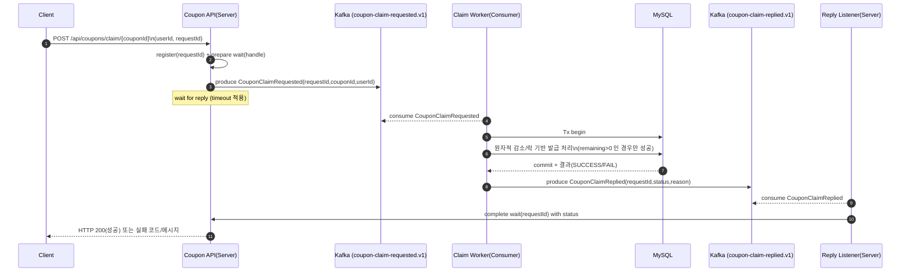
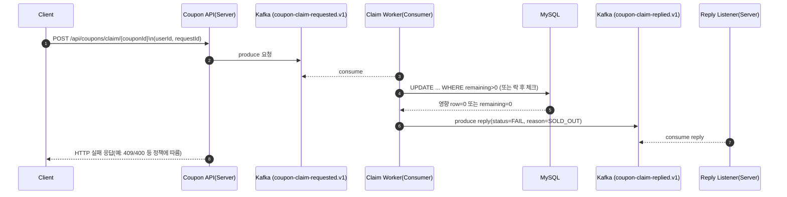

# 쿠폰 선착순 동시 발급 (Kafka 동기 대기 기반) 설계 문서

- 작성일: 2025-12-27
- 대상 런타임: Java 17 / Spring Boot 3.x / Spring Kafka
- 목적: **선착순 100장 쿠폰**에 대해 **200명이 동시에 발급 요청**해도 **정확히 100건만 성공**하도록 보장하며, API 호출 측에서는 **Kafka 처리 결과를 동기적으로 응답**받는다.

---

## 1. 배경 및 요구사항

### 1.1 기능 요구사항
- 쿠폰이 `remainingQuantity = 100`일 때,
    - 서로 다른 사용자 200명이 동시에 발급 요청하더라도
    - **성공 응답은 정확히 100건**
    - DB에 발급 내역(`UserCoupon`)은 정확히 100건
    - 쿠폰 `remainingQuantity`는 0이 된다.

### 1.2 비기능 요구사항
- 동시성 환경에서도 정합성(정확히 100건) 유지
- Kafka 기반 비동기 처리지만, API는 동기 응답(요청-응답) 제공
- 테스트 환경에서도 재현 가능한 수준의 안정성 확보

---

## 2. 전체 아키텍처 개요

### 2.1 구성 요소
- **Client** : 쿠폰 발급 API 호출자(동시성 테스트에서는 200개 스레드)
- **Coupon API(Server)**:
    - `POST /api/coupons/claim/{couponId}` 엔드포인트
    - 요청 수신 후 Kafka로 “발급 요청 이벤트” 발행
    - “발급 결과 이벤트(reply)”를 기다렸다가 HTTP로 응답
- **Kafka**
    - Topic A: `coupon-claim-requested.v1` (발급 요청)
    - Topic B: `coupon-claim-replied.v1` (발급 결과)
- **Coupon Claim Consumer(Worker)**
    - `coupon-claim-requested.v1` 구독
    - DB 트랜잭션으로 발급 로직 실행(정합성 보장)
    - 결과를 `coupon-claim-replied.v1`에 발행
- **Reply Listener(서버 내 리스너/핸들러)**
    - `coupon-claim-replied.v1` 구독
    - requestId(상관관계 키)로 “대기 중인 HTTP 요청”을 깨워 응답 완료
- **DB(MySQL)**
    - Coupon, UserCoupon 등 영속화

---

## 3. 토픽/컨슈머 설계

### 3.1 토픽 설계

| 구분 | 토픽 | 용도 | 파티션 | 비고 |
|---|---|---|---:|---|
| 요청 | `coupon-claim-requested.v1` | 발급 요청 이벤트 | 6 | 처리량/병렬성 확보 |
| 응답 | `coupon-claim-replied.v1` | 발급 결과 이벤트 | 6 | requestId 기반 매칭 |

- 파티션 수가 충분하면, 컨슈머 concurrency를 높여 병렬 처리량을 올릴 수 있다.
- 단, DB 병목(커넥션 풀/락 경합)이 더 크면 Kafka 병렬화만으로 해결되지 않는다.

### 3.2 컨슈머 그룹 및 concurrency
- 발급 처리 워커는 consumer group을 사용하여 파티션을 분산 할당받는다.
- `concurrency=3`이면 한 컨테이너 인스턴스에서 3개의 consumer thread가 뜬다.
- Reply listener는 `concurrency=1`로 두어도 되지만, 응답량이 많으면 늘릴 수 있다.

> 운영/테스트에서 반드시 `group.id`가 설정되어야 컨텍스트/컨슈머가 정상 동작한다.

---

## 4. 메시지 모델(개념)

> 필드명은 개념 수준으로 기술한다(구현체의 DTO 명/필드와 1:1 매핑을 강제하지 않음).

### 4.1 CouponClaimRequested (요청 이벤트)
- `couponId`: 발급 대상 쿠폰 ID
- `userId`: 발급 요청 사용자 ID
- `requestId`: 요청-응답 상관관계 키(클라이언트 요청마다 유일)

### 4.2 CouponClaimReplied (응답 이벤트)
- `requestId`: 요청 이벤트와 동일한 상관관계 키
- `couponId`, `userId`
- `status`: `SUCCESS` / `FAIL`
- `reason`: 실패 사유(예: SOLD_OUT, ALREADY_CLAIMED, VALIDATION_ERROR 등)

---

## 5. 동시성/정합성 보장 전략

### 5.1 DB 정합성 보장(핵심)
발급 성공이 **정확히 100건**만 나오려면, “남은 수량 감소”가 원자적으로 처리되어야 한다.

일반적인 안전한 접근은 다음 중 하나(또는 조합):

1. **조건부 UPDATE(낙관적 형태의 원자 감소)**
    - `UPDATE coupon SET remaining_quantity = remaining_quantity - 1 WHERE coupon_id=? AND remaining_quantity > 0`
    - 영향 row가 1이면 성공, 0이면 품절
2. **비관적 락(SELECT ... FOR UPDATE) + 감소**
    - 트랜잭션 내에서 쿠폰 row를 잠그고 감소
    - 경쟁이 매우 심하면 대기 시간이 늘어날 수 있음
3. **유니크 제약(중복 발급 방지)**
    - `(coupon_id, user_id)` unique 인덱스
    - 이미 발급된 유저는 재요청 시 실패 처리

본 설계의 결론:
- **성공 건수 제한(remainingQuantity)**는 DB 레벨의 원자성으로 보장
- **중복 발급**은 유니크 제약 또는 체크로 방지
- Kafka는 “처리 흐름/부하 분산”을 돕지만, 최종 정합성은 DB가 책임진다.

---

## 6. 요청-응답(동기 대기) 설계

### 6.1 동기 대기의 필요성
- API 호출자는 즉시 성공/실패를 알고 싶다.
- 그러나 실제 처리는 Kafka 워커에서 비동기 수행된다.
- 따라서 서버는 아래 구조를 가진다:
    - 요청 시 requestId 생성/확보 → “대기 테이블(인메모리/캐시)”에 등록
    - 요청 이벤트 발행
    - reply 토픽에서 동일 requestId 응답 수신 시 대기 해제
    - 타임아웃 시 실패 응답(또는 재시도 유도)

### 6.2 타임아웃 및 실패 전략
- 서버/클라이언트 모두 무한 대기를 피해야 한다.
- 테스트에서 HTTP read timeout이 너무 짧으면, 처리량이 충분해도 많은 요청이 실패할 수 있다.
- 테스트 안정성을 위해:
    - HTTP client read timeout 상향
    - DB 커넥션 풀 확장(테스트 환경)
    - consumer group-id 충돌 방지(테스트마다 고유 group-id 권장)

---

## 7. 시퀀스 다이어그램

### 7.1 정상 흐름 (성공 케이스)

### 7.2 품절 흐름 (remaining=0 도달 이후)

---

## 8. 테스트(동시성 IT) 관점의 안정성 포인트

### 8.1 필수 조건
- Kafka 브로커가 테스트 실행 시점에 접근 가능해야 한다.
- consumer에 `group.id`가 설정되어야 한다(설정 누락 시 컨텍스트 자체가 뜨지 않음).

### 8.2 처리량 병목과 테스트 파라미터
동시성 테스트에서 “성공=100이 아닌 23 같은 값”이 나오던 이슈는 보통:
- DB 커넥션 풀 부족
- HTTP read timeout 과소
- 서버 처리 스레드/DB락 경합으로 인한 지연

등으로 인해 “정합성은 맞아도(실제로는 100개 발급되었어도) 응답이 제때 못 오거나, 요청 자체가 실패”할 수 있다.

테스트 안정화를 위한 권장:
- 테스트 환경에서 `spring.datasource.hikari.maximum-pool-size`를 충분히 크게
- HTTP client read timeout을 현실적으로 상향
- 테스트 간 메시지 재소비 영향을 줄이기 위해 group-id를 테스트마다 고유하게(권장)

---

## 9. 운영 체크리스트

- [ ] Kafka 토픽 존재 및 파티션 수 확인
- [ ] consumer group-id 설정 및 컨슈머 정상 join 확인
- [ ] DB 커넥션 풀/락 경합 모니터링
- [ ] reply 누락 시 타임아웃 처리 정책 정의(클라이언트 재시도 전략 포함)
- [ ] 중복 발급 방지(유니크 제약 등) 검증

---

## 10. 결론

본 설계는 다음을 달성한다:
- Kafka로 요청을 비동기 처리하면서도,
- API 레벨에서는 동기 응답 UX를 제공하고,
- “선착순 100장” 정합성은 DB 원자성으로 보장한다.

또한 통합 테스트 관점에서는 Kafka 준비/consumer group-id/DB 풀/HTTP 타임아웃이 안정성의 핵심 변수임을 확인했고, 이를 적절히 조정하면 200 동시 요청에서도 성공 100건을 안정적으로 재현할 수 있다.
